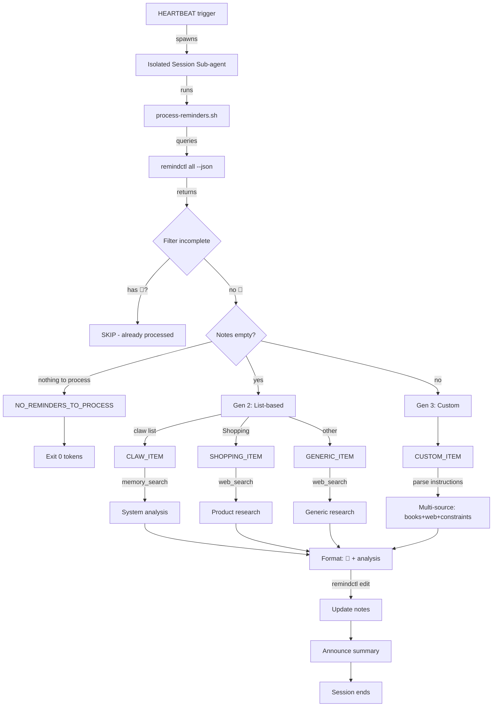

# Reminder Research

**v3 Evolution:** Custom instructions + auto-processing + result tracking

## 🔧 Setup

**Required:**
1. Install `remindctl`: `brew install steipete/tap/remindctl`
2. Install `jq`: `brew install jq`
3. Grant Reminders permission: `remindctl authorize`

**Optional (for web research):**
1. Get Brave Search API key: https://brave.com/search/api/
2. Configure: `openclaw configure --section web`
3. Set `BRAVE_API_KEY` when prompted

**Optional (for book research):**
- Install librarian skill (requires external project)

**Cron scheduling (recommended):**
```bash
# Add via OpenClaw cron tool
cron add --schedule "0 3 * * *" --payload "Run reminder-research skill..."
```

Or run manually:
```bash
~/Documents/skills/reminder-research/process-reminders.sh
```

---



## 🎯 Three Generations

### **Gen 1 (Manual - deprecated)**
```
Title: 🔍 Pesquise tarot no livro
Notes: (empty)
→ Manual emoji trigger
```

### **Gen 2 (Auto - current baseline)**
```
Title: Stacker bag
Notes: (empty)
→ Auto-detect empty notes
→ List-based behavior (shopping/claw/generic)
```

### **Gen 3 (Custom - NEW)**
```
Title: Bitcoin ETF regulation
Notes: "Procure no livro de David Graeber sobre anarchism + web search SEC rulings 2024"
→ Follow custom instructions
→ Output: "💎 [resultado da pesquisa]"
```

## 🔑 Signifiers

**💎 = RESULT** (already processed)
- For Nicholas: "Read the report, it's done"
- For Claw: "Skip this, already researched"

**No 💎 = NEEDS PROCESSING**
- Empty notes → list-based default behavior
- Notes with instructions → follow custom research path

## 📋 Processing Logic

### Detection
```bash
process-reminders.sh
```

**Output types:**
```
NO_REMINDERS_TO_PROCESS          # Nothing to do
CLAW_ITEM|<id>|<title>            # System improvement (empty notes)
SHOPPING_ITEM|<id>|<title>        # Product search (empty notes)
GENERIC_ITEM|<id>|<list>|<title>  # Generic research (empty notes)
CUSTOM_ITEM|<id>|<list>|<title>|<instructions>  # Custom instructions (Gen 3)
```

### AI Processing

**For CUSTOM_ITEM:**
1. Parse custom instructions from notes
2. Execute multi-source research:
   - If mentions "livro/book" → use librarian skill
   - If mentions "web search" → use web_search
   - If mentions specific sources → prioritize those
3. Combine findings
4. Update notes: `💎 [research findings]`

**For CLAW_ITEM:**
1. Run `memory_search` for similar past issues
2. Analyze pattern (frequency, context, impact)
3. Propose solutions (tech/process/system)
4. Update notes: `💎 [analysis + solutions]`

**For SHOPPING_ITEM:**
1. Web search: product + "buy" + "price"
2. Priority sites: Temu, Shop.app, AliExpress (avoid Amazon)
3. Extract: links, prices, ratings
4. Update notes: `💎 [shopping findings]`

**For GENERIC_ITEM:**
1. Web search: title + context from list name
2. Find: tutorials, how-to, documentation
3. Summarize key findings
4. Update notes: `💎 [research summary]`

## 💎 Result Format

**Start with 💎 signifier:**
```
💎 RESEARCH RESULTS

**Sources:**
- Book: "Debt: The First 5000 Years" by David Graeber, Chapter 7
- Web: SEC ruling 2024-08 (Bitcoin ETF approval)

**Summary:**
[Key findings organized by source]

**Next steps:**
[Actionable recommendations if applicable]
```

## 📊 List-Based Behavior (Gen 2)

| List | Action | Output Format |
|------|--------|---------------|
| 🛒 Groceries | SKIP | (no processing) |
| claw | System analysis | 💎 Pattern + solutions |
| Shopping | Product search | 💎 Links + prices |
| Others | Generic research | 💎 Summary + sources |

## 🎨 Custom Instructions (Gen 3)

**Example prompts in notes:**

**Multi-source research:**
```
Procure no livro de finance + web search "mortgage prepayment calculator"
```

**Specific constraints:**
```
Web search only (no books). Focus on 2024 data. Avoid crypto sites.
```

**Librarian focus:**
```
Pesquise nos livros de tarot + I Ching. Compare interpretations.
```

**Shopping with constraints:**
```
Where to buy. Budget under $50. Avoid Amazon.
```

## 🔄 Heartbeat Integration

**Triggered by HEARTBEAT** (configurable schedule):
```bash
RESULT=$(process-reminders.sh)

if [ "$RESULT" = "NO_REMINDERS_TO_PROCESS" ]; then
  # Exit immediately - 0 tokens spent
  exit 0
fi

# Otherwise: Parse each item type, research, update notes
```

**Lean behavior:** If nothing needs processing → script exits, no AI session spawned, zero cost.

## 📝 Update Reminder Notes

```bash
remindctl edit <id> --notes "💎 [your research findings here]"
```

## 🎯 Use Cases

**System debugging:**
```
List: claw
Title: Messages disappear after reindexing
Notes: (empty)
→ Auto: Pattern analysis + 4 solution tiers
→ Result: "💎 ANALYSIS: [pattern] SOLUTIONS: [1-4]"
```

**Product research:**
```
List: Shopping
Title: iPad mini 6, second hand
Notes: (empty)
→ Auto: Web search eBay/Swappa/Facebook Marketplace
→ Result: "💎 FOUND: eBay $350, Swappa $380..."
```

**Custom deep research:**
```
List: TODO
Title: Bitcoin regulation impact
Notes: "Procure no livro 'Debt' by Graeber (debt history) + web search 'SEC Bitcoin ETF 2024 ruling'"
→ Custom: Librarian search + web search
→ Result: "💎 RESEARCH RESULTS\n\nBook: Graeber argues...\n\nWeb: SEC approved..."
```

**Follow-up instructions:**
```
List: Creative Code
Title: Vertical slider library
Notes: "Find React examples on GitHub. Check if any use Framer Motion. Budget: MIT license only."
→ Custom: GitHub code search with constraints
→ Result: "💎 FOUND: 3 MIT-licensed libs using Framer..."
```

## 🚫 What NOT to Process

- ✅ Notes start with 💎 → already processed, skip
- ✅ List = 🛒 Groceries → no research needed
- ✅ Completed reminders → ignored

## Architecture

For system design, data flow, and implementation details, see [references/architecture.md](references/architecture.md).

## Dependencies
- `remindctl` (Apple Reminders CLI)
- `jq` (JSON processing)
- OpenClaw `web_search` tool
- OpenClaw `memory_search` tool (for claw items)
- Librarian skill (for book research)
