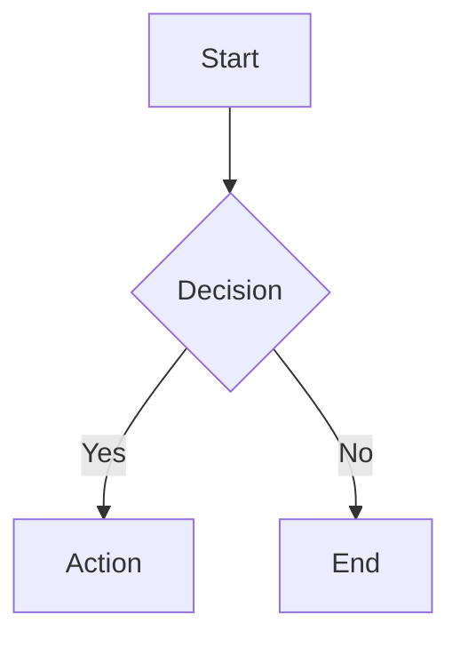
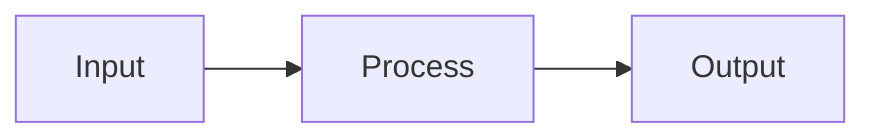

# BangunAI Blog Manager (Digital Garden + Content Workflow)

**Homepage:** React 18 + Vite + MDX + shadcn/ui  
**Blog Root:** `/home/hades/BangunAI-Blog`  
**Content Root:** `/home/hades/BangunAI-Blog/src/content`  
**Tech Stack:** TypeScript, Tailwind CSS, Mermaid 11, KaTeX, Shiki

Skill ini menggabungkan:
- workflow custom untuk blog content (daily, fetch style, universal writer, logging, smart read)
- MDX authoring untuk React-based digital garden
- Obsidian-like features (callouts, mermaid diagrams, LaTeX math, wikilinks, backlinks)
- Auto-import system via `import.meta.glob`

---

## 🌿 BangunAI Blog Fundamentals

Blog ini adalah **Digital Garden & Knowledge Base** dengan fitur terinspirasi dari Obsidian.

### Struktur Proyek

```
/home/hades/BangunAI-Blog/
├── src/
│   ├── content/
│   │   ├── writing/       # Blog posts (notes, essays)
│   │   ├── articles/      # Technical articles, tutorials
│   │   ├── read/          # Reading notes, link curation
│   │   ├── daily/         # Daily notes (tasks, logs)
│   │   ├── about.mdx      # About page (single file)
│   │   ├── now.mdx        # Now page (current activities)
│   │   └── index.ts       # Auto-import loader
│   ├── components/        # React components (40+ shadcn/ui)
│   │   ├── Callout.tsx    # 14 tipe callouts
│   │   ├── MermaidDiagram.tsx  # Mermaid renderer
│   │   ├── WikiLink.tsx   # Internal linking
│   │   ├── Backlinks.tsx  # Auto backlinks
│   │   ├── GraphView.tsx  # Knowledge graph
│   │   └── ui/            # shadcn/ui components
│   ├── pages/             # Route pages
│   ├── lib/               # Utilities
│   │   ├── date.ts        # Date formatting
│   │   └── utils.ts       # Class utilities
│   └── data/
│       ├── posts.ts       # Helper functions
│       └── types.ts       # TypeScript types
├── public/                # Static assets
├── skill/                 # Agent skills (this!)
└── package.json           # Dependencies
```

### Content Types

| Type | Description | Location | Features |
|------|-------------|----------|----------|
| **Writing** | Personal notes, essays | `src/content/writing/` | Filter by type (note/essay), category, tags |
| **Articles** | Technical tutorials, guides | `src/content/articles/` | Grouped by year |
| **Read** | Curated readings with notes | `src/content/read/` | Source URL, snippet, tags |
| **Daily** | Daily notes, tasks, logs | `src/content/daily/` | Rollover tasks, timestamps |
| **About** | About page (MDX) | `src/content/about.mdx` | Single static page |
| **Now** | Current activities | `src/content/now.mdx` | Updated regularly |

### Auto-Import System

File `src/content/index.ts` auto-detect semua `.mdx` files via `import.meta.glob`:

```typescript
// NO MANUAL REGISTRATION NEEDED!
const writingModules = import.meta.glob("./writing/*.mdx", { eager: true });
const articleModules = import.meta.glob("./articles/*.mdx", { eager: true });
const readModules = import.meta.glob("./read/*.mdx", { eager: true });
```

**Benefits:** Create file → Auto-detected → Available immediately

---

## 📝 Frontmatter Formats

### Format A: Standard Posts (writing, articles, daily)

```yaml
---
title: "Judul Artikel Yang Menarik"
slug: judul-artikel-yang-menarik
summary: "Ringkasan singkat 1-2 kalimat yang compelling."
type: note                # note | essay | article
category: Tech            # Tech | Refleksi | Produktivitas | Linux | Coding | Life
tags: [react, typescript, tutorial]
date: "2026-02-11T14:30:00"
readingTime: 5
featured: false           # (optional) untuk featured posts
---
```

**Required Fields:**
- `title` — Judul artikel (string)
- `slug` — URL-friendly slug (kebab-case)
- `summary` — Deskripsi singkat, compelling (1-2 kalimat)
- `type` — Jenis konten:
  - `note` — Catatan pendek, quick takes
  - `essay` — Tulisan mendalam, eksploratif
  - `article` — Tutorial, panduan terstruktur
- `category` — Kategori utama (pilih salah satu):
  - `Tech` — Teknologi, programming, tools
  - `Refleksi` — Personal reflection, thoughts
  - `Produktivitas` — Productivity, workflow
  - `Linux` — Linux, terminal, sysadmin
  - `Coding` — Coding practices, patterns
  - `Life` — Lifestyle, experiences
- `tags` — Array tags (lowercase, kebab-case)
- `date` — ISO timestamp dengan jam (`YYYY-MM-DDTHH:mm:ss`)
- `readingTime` — Estimasi menit baca (~200 kata/menit)

**Optional Fields:**
- `featured` — Boolean, untuk featured posts di homepage

### Format B: Read Items (read/)

```yaml
---
title: "Judul Artikel/Bacaan"
slug: judul-artikel-bacaan
snippet: "Quote atau snippet menarik dari artikel (1-2 kalimat)."
source: "nama-situs.com"
url: "https://link-ke-artikel.com"
tags: [programming, career]
date: "2026-02-11T18:00:00"
---

## Catatan Personal (Optional)

Komentar atau catatan tentang bacaan ini...
```

**Required Fields:**
- `title` — Judul artikel (string)
- `slug` — URL-friendly slug (kebab-case)
- `snippet` — Quote/excerpt menarik dari artikel
- `source` — Domain sumber (e.g., `github.com`, `dev.to`)
- `url` — Link lengkap ke artikel asli
- `tags` — Array tags (lowercase)
- `date` — ISO timestamp

**Body Content:** Optional, untuk catatan personal

### Format C: Special Pages (about, now)

```yaml
---
title: "About"  # atau "Now"
---

Content langsung di sini...
Mendukung semua fitur MDX (callouts, highlight, mermaid, dll).
```

**Minimal frontmatter:** Hanya `title`

---

## 🧩 MDX Components Available

### 1. Callouts (14 Types)

```mdx
<Callout type="info" title="Judul Callout">
Isi callout di sini.
</Callout>
```

**Available types:**
- `info` — Informasi umum (biru)
- `tip` — Tips & tricks (hijau)
- `warning` — Peringatan (kuning)
- `danger` — Danger/error (merah)
- `success` — Success message (hijau cerah)
- `note` — Catatan (abu-abu)
- `example` — Contoh (ungu)
- `bug` — Bug report (merah)
- `question` — Pertanyaan (biru muda)
- `abstract` — Abstract/summary (indigo)
- `important` — Penting (orange)
- `caution` — Hati-hati (kuning gelap)
- `quote` — Kutipan (krem)
- `cite` — Sitasi (krem gelap)

**Obsidian Blockquote Syntax:**
```mdx
> [!info] Judul Callout
> Isi callout menggunakan sintaks Obsidian.
```

### 2. Mermaid Diagrams

````mdx

````

**Supported diagrams (Mermaid v11):**
- `graph` / `flowchart` — Flowchart
- `sequenceDiagram` — Sequence diagram
- `pie` — Pie chart
- `classDiagram` — UML class diagram
- `stateDiagram-v2` — UML state diagram
- `erDiagram` — Entity relationship diagram
- `gantt` — Gantt chart
- `mindmap` — Mind map
- `timeline` — Timeline

**Features:**
- Auto-render dengan tema terang/gelap
- Unique ID per diagram (no conflicts)
- Responsive container

### 3. LaTeX Math (KaTeX)

```mdx
Inline: $E = mc^2$

Block:
$$
\int_0^\infty e^{-x} dx = 1
$$
```

**Powered by KaTeX 0.16** — Fast math rendering

### 4. WikiLinks (Internal Links)

```mdx
<WikiLink to="slug-artikel" label="Teks yang Ditampilkan" />
```

**Features:**
- Link mati (slug not found) → strikethrough otomatis
- Auto-deteksi dari semua posts

### 5. Highlight

```mdx
<Highlight>teks yang di-highlight</Highlight>

Atau gunakan HTML tag:
<mark>teks yang di-highlight</mark>
```

### 6. YouTube Embed

```mdx
<YouTube url="https://youtube.com/watch?v=VIDEO_ID" title="Judul Video" />
```

**Features:**
- Responsive iframe
- Auto-aspect ratio 16:9

### 7. Code Blocks (Shiki Syntax Highlighting)

````mdx
```typescript
function hello(name: string): string {
  return `Hello, ${name}!`;
}
```
````

**Features:**
- Powered by Shiki with `github-dark-dimmed` theme
- Copy button included
- Multi-language support (TypeScript, Python, Bash, dll)

### 8. GFM (GitHub Flavored Markdown)

**Tables:**
```mdx
| Column 1 | Column 2 |
|----------|----------|
| Value A  | Value B  |
```

**Task Lists:**
```mdx
- [x] Completed task
- [ ] Uncompleted task
```

**Strikethrough:**
```mdx
~~deleted text~~
```

### 9. Backlinks

Auto-generated di setiap artikel detail. Menampilkan artikel lain yang me-link ke artikel ini.

### 10. Graph View

Interactive force-directed graph menampilkan koneksi antar konten.

### 11. Table of Contents (TOC)

- Sticky di desktop (right sidebar)
- Collapsible bottom bar di mobile
- Active heading tracking
- Progress bar

---

## 🎨 Design System

### Color Tokens (HSL-based)

**Dark Mode (Default):**
- `--background` — Navy gelap (#1A1A2E)
- `--foreground` — Cream (#F5E6D3)
- `--primary` — Gold/amber (aksen utama)
- `--accent` — Warm gold (hover states)
- `--card` — Navy lebih terang

**Light Mode:**
- `--background` — Cream hangat
- `--foreground` — Navy gelap
- `--primary` — Amber gelap
- `--card` — Cream lebih gelap

**Usage:**
```tsx
// ✅ Gunakan semantic tokens
<div className="bg-background text-foreground">
  <button className="bg-primary text-primary-foreground">
    Klik
  </button>
</div>

// ❌ Jangan hardcode warna
<div className="bg-[#1A1A2E] text-[#F5E6D3]">
```

### Font Stack

| Font | Usage |
|------|-------|
| **Space Grotesk** | Headings & navigation |
| **Source Serif 4** | Body text artikel (serif) |
| **Inter** | UI elements & labels |
| **JetBrains Mono** | Code blocks & inline code |

### Glass Morphism

```tsx
<div className="glass glass-hover rounded-xl p-6">
  Konten dengan efek kaca transparan
</div>
```

---

## 🔧 Workflows

### 1) `daily` (Smart Daily Note)

Create daily note dengan auto-rollover unchecked tasks dari kemarin.

```bash
BLOG_ROOT="/home/hades/BangunAI-Blog"
DAILY_DIR="$BLOG_ROOT/src/content/daily"
mkdir -p "$DAILY_DIR"

TODAY=$(date +%Y-%m-%d)
FILE="$DAILY_DIR/$TODAY.mdx"
LAST_FILE=$(find "$DAILY_DIR" -name "????-??-??.mdx" ! -name "$TODAY.mdx" 2>/dev/null | sort | tail -n 1)

if [ ! -f "$FILE" ]; then
  cat > "$FILE" <<EOF
---
title: "Daily Note: $TODAY"
date: "$TODAY"
type: daily
tags: [daily]
---

# Daily Note: $TODAY

EOF

  if [ -n "$LAST_FILE" ]; then
    PENDING=$(grep "\- \[ \]" "$LAST_FILE" || true)
    if [ -n "$PENDING" ]; then
      echo "## Rollover Tasks" >> "$FILE"
      echo "" >> "$FILE"
      echo "$PENDING" >> "$FILE"
      echo "" >> "$FILE"
    fi
  fi
  
  cat >> "$FILE" <<EOF
## Tasks Today

- [ ] 

## Log

EOF
  echo "✅ Created: $FILE"
else
  echo "📂 Exists: $FILE"
fi
```

### 2) `fetch_last` (Style Reference)

Fetch latest file untuk style reference. Supports all categories including special pages.

```bash
# Input: CATEGORY (writing, articles, read, daily, about, now)
BLOG_ROOT="/home/hades/BangunAI-Blog"
case "$CATEGORY" in
  "daily") DIR="$BLOG_ROOT/src/content/daily" ;;
  "writing") DIR="$BLOG_ROOT/src/content/writing" ;;
  "articles") DIR="$BLOG_ROOT/src/content/articles" ;;
  "read") DIR="$BLOG_ROOT/src/content/read" ;;
  "about") 
    cat "$BLOG_ROOT/src/content/about.mdx"
    exit 0
    ;;
  "now") 
    cat "$BLOG_ROOT/src/content/now.mdx"
    exit 0
    ;;
  *) echo "❌ Unknown category"; exit 1 ;;
esac
LAST_FILE=$(ls -t "$DIR"/*.mdx 2>/dev/null | head -n 1)
if [ -f "$LAST_FILE" ]; then
  echo "📄 REFERENSI GAYA ($LAST_FILE):"
  head -n 50 "$LAST_FILE"
else
  echo "❌ Belum ada file di $CATEGORY"
fi
```

### 3) `write` (Universal Writer + BangunAI Style)

Write new content dengan frontmatter lengkap.

**For Writing/Articles:**
```bash
CATEGORY="writing"  # atau "articles"
FILENAME="judul-artikel.mdx"
BLOG_ROOT="/home/hades/BangunAI-Blog"

cat > "$BLOG_ROOT/src/content/$CATEGORY/$FILENAME" <<'EOF'
---
title: "Judul Artikel Baru"
slug: judul-artikel-baru
summary: "Ringkasan singkat tentang artikel ini yang menarik perhatian pembaca."
type: note
category: Tech
tags: [react, typescript, tutorial]
date: "2026-02-12T15:00:00"
readingTime: 5
---

## Introduction

Paragraf pembuka yang compelling dan menarik perhatian.

<Callout type="tip" title="Pro Tip">
Gunakan callouts untuk highlight informasi penting!
</Callout>

## Section 1

### Subsection A

Content here dengan **bold** dan *italic*.

```typescript
// Example code dengan syntax highlighting
function example(): string {
  return "Hello World";
}
```

## Mermaid Example



## Math Example

Inline math: $x^2 + y^2 = z^2$

Block math:
$$
\sum_{i=1}^{n} i = \frac{n(n+1)}{2}
$$

## Internal Link

Check out <WikiLink to="other-article" label="this related article" />.

## Conclusion

Kesimpulan yang solid dan actionable.
EOF

echo "✅ Created: $BLOG_ROOT/src/content/$CATEGORY/$FILENAME"
```

**For Read Items:**
```bash
CATEGORY="read"
FILENAME="interesting-article.mdx"
BLOG_ROOT="/home/hades/BangunAI-Blog"

cat > "$BLOG_ROOT/src/content/$CATEGORY/$FILENAME" <<'EOF'
---
title: "Interesting Article Title"
slug: interesting-article
snippet: "A compelling quote or snippet from the article that captures its essence."
source: "website.com"
url: "https://website.com/article"
tags: [tech, programming, career]
date: "2026-02-12T15:00:00"
---

## Key Takeaways

- Point 1: Important insight
- Point 2: Actionable advice
- Point 3: Thought-provoking idea

## Personal Notes

My thoughts and commentary about this article...

<Callout type="note">
This reminds me of a similar concept in...
</Callout>
EOF

echo "✅ Created: $BLOG_ROOT/src/content/$CATEGORY/$FILENAME"
```

### 4) `log` (Append Log)

Append timestamped log to today's daily note.

```bash
# Input: CONTENT="..."
TODAY=$(date +%Y-%m-%d)
FILE="/home/hades/BangunAI-Blog/src/content/daily/$TODAY.mdx"
if [ ! -f "$FILE" ]; then 
  echo "❌ Run 'daily' workflow first!"
  exit 1
fi
echo "- $(date +%H:%M) $CONTENT" >> "$FILE"
echo "✅ Logged to: $FILE"
```

### 5) `read` (Smart Read)

Smart search content by keyword.

```bash
# Input: FILE="..."
find "/home/hades/BangunAI-Blog/src/content" -name "*$FILE*.mdx" | head -n 1 | xargs -r cat
```

### 6) `update_about` (Update About Page)

Update about.mdx with MDX content.

```bash
# Input: CONTENT="..."
FILE="/home/hades/BangunAI-Blog/src/content/about.mdx"
cat > "$FILE" <<EOF
---
title: "About"
---

$CONTENT
EOF
echo "✅ Updated: $FILE"
```

### 7) `update_now` (Update Now Page)

Update now.mdx with current activities.

```bash
# Input: CONTENT="..."
FILE="/home/hades/BangunAI-Blog/src/content/now.mdx"
CURRENT_DATE=$(date +"%B %Y")
cat > "$FILE" <<EOF
---
title: "Now"
---

## Apa yang Sedang Saya Kerjakan

*Terakhir diperbarui: $CURRENT_DATE*

Halaman ini terinspirasi dari [nownownow.com](https://nownownow.com) — tempat saya mencatat apa yang sedang saya fokuskan saat ini.

---

$CONTENT

---

> *Halaman ini adalah snapshot dari kehidupan saya saat ini. Bukan resume, bukan portofolio — hanya update jujur tentang apa yang sedang saya kerjakan.*
EOF
echo "✅ Updated: $FILE"
```

### 8) `verify_index` (Verify Content)

Verify content auto-import statistics.

```bash
BLOG_ROOT="/home/hades/BangunAI-Blog"
echo "📊 Content Statistics:"
echo ""
echo "Writing posts: $(ls -1 "$BLOG_ROOT/src/content/writing"/*.mdx 2>/dev/null | wc -l)"
echo "Articles: $(ls -1 "$BLOG_ROOT/src/content/articles"/*.mdx 2>/dev/null | wc -l)"
echo "Read items: $(ls -1 "$BLOG_ROOT/src/content/read"/*.mdx 2>/dev/null | wc -l)"
echo "Daily notes: $(ls -1 "$BLOG_ROOT/src/content/daily"/*.mdx 2>/dev/null | wc -l)"
echo ""
echo "Special files:"
echo "- about.mdx: $(test -f "$BLOG_ROOT/src/content/about.mdx" && echo "✅" || echo "❌")"
echo "- now.mdx: $(test -f "$BLOG_ROOT/src/content/now.mdx" && echo "✅" || echo "❌")"
echo "- index.ts: $(test -f "$BLOG_ROOT/src/content/index.ts" && echo "✅" || echo "❌")"
```

---

## 📋 Content Category Guidelines

| Category | Path | Use Case | Type Options | Examples |
|----------|------|----------|--------------|----------|
| `writing` | `src/content/writing/` | Personal notes, essays | `note`, `essay` | Reflections, quick takes, deep thoughts |
| `articles` | `src/content/articles/` | Technical tutorials, guides | `article` | How-to guides, technical deep dives |
| `read` | `src/content/read/` | Reading notes, link curation | N/A (special format) | Curated articles, bookmarks |
| `daily` | `src/content/daily/` | Daily notes, tasks, logs | `daily` | Task tracking, daily logs |
| `about` | `src/content/about.mdx` | About page (static) | N/A | Personal bio, site info |
| `now` | `src/content/now.mdx` | Current activities | N/A | What I'm doing now |

### Category Values

**Choose wisely untuk `category` field:**
- `Tech` — Teknologi, programming, tools, frameworks
- `Refleksi` — Personal reflection, thoughts, philosophy
- `Produktivitas` — Productivity tips, workflow, GTD
- `Linux` — Linux, terminal, system administration
- `Coding` — Coding practices, patterns, best practices
- `Life` — Lifestyle, personal experiences, stories

---

## 🎯 Best Practices

### 1. Frontmatter Consistency

**DO:**
```yaml
title: "Belajar React Hooks di 2026"
slug: belajar-react-hooks-2026
type: note
category: Tech
tags: [react, hooks, javascript]
date: "2026-02-12T15:30:00"
```

**DON'T:**
```yaml
title: belajar-react-hooks    # Missing quotes
slug: Belajar React Hooks     # Not kebab-case
type: blog                     # Invalid type
category: technology           # Typo/wrong value
tags: React, Hooks             # Not array format
date: "2026-02-12"            # Missing time
```

### 2. File Naming

**DO:**
```
belajar-react-hooks-2026.mdx
setup-neovim-lua.mdx
refleksi-tahun-2025.mdx
```

**DON'T:**
```
Blog Post 1.mdx              # Spaces, not descriptive
temp.mdx                     # Non-descriptive
NEW_POST.mdx                 # Uppercase, underscore
```

### 3. Content Structure

**Recommended structure:**
```mdx
---
frontmatter here
---

## Introduction (H2)
Brief intro, hook the reader.

<Callout type="info">
Context or prerequisite info.
</Callout>

## Main Section 1 (H2)

### Subsection A (H3)
Content...

### Subsection B (H3)
Content...

## Main Section 2 (H2)

### Examples (H3)
Code or examples...

## Conclusion (H2)
Summary and takeaways.
```

### 4. Using MDX Components

**DO:**
```mdx
<Callout type="tip" title="Pro Tip">
Use semantic components for better UX.
</Callout>

<WikiLink to="related-article" label="Read more about this" />
```

**DON'T:**
```mdx
<div style="background: yellow; padding: 10px;">
Hardcoded styling instead of using Callout
</div>

<a href="/artikel/related-article">Read more</a>
<!-- Should use WikiLink instead -->
```

### 5. Date & Time Format

**ISO timestamp with time:**
```yaml
date: "2026-02-12T15:30:00"  # YYYY-MM-DDTHH:mm:ss
```

**Displayed as:**
- Detail page: `11 Februari 2026, 14:30`
- Card list: `11 Feb · 14:30`

### 6. Reading Time Estimation

```bash
# Count words (exclude frontmatter)
WORD_COUNT=$(tail -n +$(grep -n "^---$" file.mdx | tail -1 | cut -d: -f1) file.mdx | wc -w)

# Calculate reading time (200 words/minute)
READING_TIME=$(( (WORD_COUNT + 199) / 200 ))

# Add to frontmatter
readingTime: $READING_TIME
```

### 7. Tags Best Practices

- Use **lowercase**
- Use **kebab-case** for multi-word tags
- Keep tags **consistent** across posts
- Prefer **specific** over generic tags

**Good tags:**
```yaml
tags: [react-hooks, typescript, state-management]
```

**Bad tags:**
```yaml
tags: [React Hooks, programming, stuff]
```

---

## 🚀 Development Workflow

### Local Development

```bash
# Start dev server
cd /home/hades/BangunAI-Blog
bun run dev
# Open http://localhost:8080
```

### Create New Content

1. **Fetch style reference:**
   ```bash
   CATEGORY="writing" bash fetch_last.sh
   ```

2. **Create new file:**
   ```bash
   cat > src/content/writing/new-post.mdx <<'EOF'
   ---
   title: "New Post"
   slug: new-post
   summary: "Brief summary"
   type: note
   category: Tech
   tags: [tag1, tag2]
   date: "$(date -Iseconds)"
   readingTime: 5
   ---
   
   Content here...
   EOF
   ```

3. **Verify auto-import:**
   ```bash
   # File otomatis terdeteksi via import.meta.glob
   # Check di browser: http://localhost:8080/writing
   ```

4. **Build & deploy:**
   ```bash
   bun run build
   bun run preview
   ```

### Git Workflow

```bash
# Add new content
git add src/content/writing/new-post.mdx
git commit -m "Add: new blog post about X"

# Rename (preserve history)
git mv src/content/writing/old.mdx src/content/writing/new.mdx
git commit -m "Rename: old post to new name"

# Delete (tracked)
git rm src/content/writing/unwanted.mdx
git commit -m "Remove: unwanted post"

# Push
git push origin main
```

---

## 🔍 Troubleshooting

### Issue: Content not showing

**Check:**
1. Valid frontmatter? (all required fields present)
2. Valid MDX syntax? (no unclosed tags)
3. File in correct directory?
4. Dev server restarted?

### Issue: Mermaid not rendering

**Check:**
1. Valid Mermaid syntax?
2. Diagram type supported?
3. Check browser console for errors

### Issue: WikiLink shows strikethrough

**Reason:** Target slug not found

**Fix:**
1. Verify target slug exists
2. Check spelling
3. Ensure target file has valid frontmatter

### Issue: LaTeX not rendering

**Check:**
1. Valid LaTeX syntax?
2. Escaped special characters?
3. Using `$` or `$$` delimiters correctly?

---

## 📚 Quick Reference

### Frontmatter Cheatsheet

**Writing/Articles:**
```yaml
---
title: "Title"
slug: slug
summary: "Summary"
type: note|essay|article
category: Tech|Refleksi|Produktivitas|Linux|Coding|Life
tags: [tag1, tag2]
date: "YYYY-MM-DDTHH:mm:ss"
readingTime: number
---
```

**Read:**
```yaml
---
title: "Title"
slug: slug
snippet: "Snippet"
source: "domain.com"
url: "https://..."
tags: [tag1, tag2]
date: "YYYY-MM-DDTHH:mm:ss"
---
```

**Special Pages:**
```yaml
---
title: "About|Now"
---
```

### MDX Components Cheatsheet

| Component | Usage |
|-----------|-------|
| Callout | `<Callout type="info" title="...">...</Callout>` |
| Mermaid | ` ```mermaid ... ``` ` |
| LaTeX | `$...$` or `$$...$$` |
| WikiLink | `<WikiLink to="slug" label="..." />` |
| Highlight | `<Highlight>...</Highlight>` |
| YouTube | `<YouTube url="..." title="..." />` |

### File Locations Cheatsheet

| Type | Location |
|------|----------|
| Writing | `src/content/writing/*.mdx` |
| Articles | `src/content/articles/*.mdx` |
| Read | `src/content/read/*.mdx` |
| Daily | `src/content/daily/*.mdx` |
| About | `src/content/about.mdx` |
| Now | `src/content/now.mdx` |
| Index | `src/content/index.ts` |

---

## 🎉 Summary

Skill ini fully integrated dengan **BangunAI Blog**:
- ✅ 8 workflows ready to use
- ✅ 3 frontmatter formats supported
- ✅ Complete MDX components reference
- ✅ Obsidian-like features documented
- ✅ Design system guidelines
- ✅ Best practices & troubleshooting
- ✅ Auto-import via `import.meta.glob`
- ✅ Git-based operations
- ✅ Production-ready

**Homepage:** https://github.com/dwirx/BangunAI-Blog
