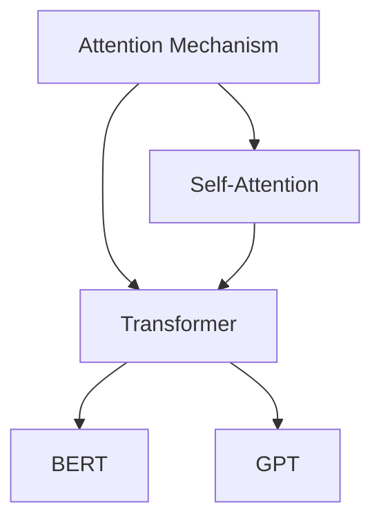

# Knowledge Graph Builder

## Overview

知识图谱构建模块，将学习内容可视化为知识网络。自动识别概念之间的关系，生成结构化的知识图谱，帮助用户建立系统性的知识体系。

## Core Capabilities

### 1. 概念关系识别
- 自动识别概念间关系类型
- 构建层级结构
- 发现跨领域连接

### 2. 图谱可视化
- 生成Mermaid图表
- 支持多种布局
- 交互式展示

### 3. 知识导航
- 路径发现
- 影响分析
- 学习路径推荐

## Usage

```typescript
import KnowledgeGraph from './scripts/graph';

const builder = new KnowledgeGraph();

// 从概念列表构建图谱
const graph = await builder.build(['transformer', 'attention', 'BERT', 'GPT']);

// 导出为Mermaid格式
const mermaidCode = builder.toMermaid(graph);

// 发现学习路径
const path = builder.findPath(graph, 'attention', 'GPT');
```

## Output Format


