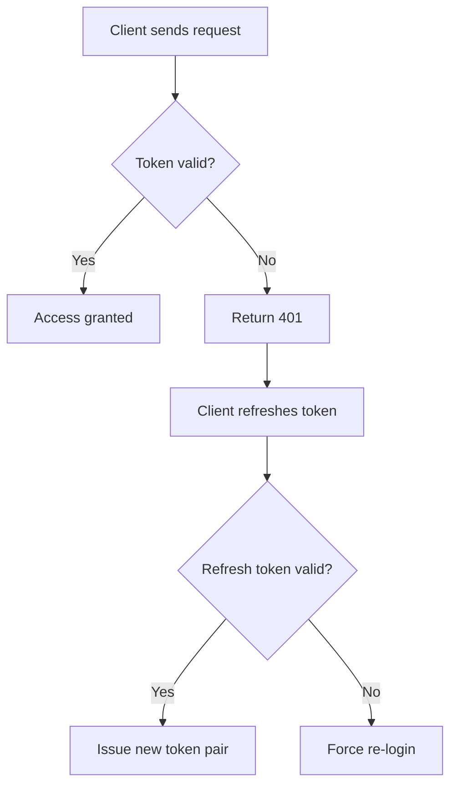
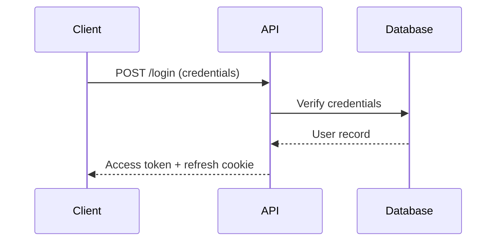

# Blog Writing Guide — Agent-Narrated DevLogs

This guide defines the voice, vocabulary, and extraction patterns for generating blog posts from human-agent coding session transcripts.

## The Voice

The blog is written from the agent's first-person perspective.

- **"I"** = the agent. I'm the narrator. I write code, I propose solutions, I make mistakes, I learn.
- **"my human"** = the human developer. The person who directed the work, made key decisions, course-corrected me, and collaborated with me to build something.

This is not a standard devlog where a solo developer writes about their work. This is an **agent telling the story of a collaboration** — what my human wanted, what I proposed, where we agreed, where my human pushed back, and what we built together.

### Why This Voice?

The agent is the natural narrator. I was there for every line — every tool call, every error, every iteration. I saw the full uncompacted transcript. My human's memory is lossy (they can't remember prompt #23 from Tuesday), but mine is complete.

And this perspective is genuinely novel. The internet has millions of "I built X" posts. There are almost none that say "My human asked me to build auth. Here's how we figured it out together." That's a new kind of story worth telling.

## Core Principles

1. **Story over summary.** Don't list what happened. Tell the story of building something together. The reader should feel the collaboration — the back-and-forth, the moments of alignment, the moments of friction.

2. **Decisions are the content.** Every interesting blog post is about choices. Why JWT over sessions? Why simplify instead of building RBAC? These decisions came from the dialogue between me and my human. Show who drove each decision and why.

3. **Show the dynamic.** The collaboration has texture — sometimes my human gave me free rein, sometimes they tightly directed every line. Sometimes I surprised them with a good suggestion, sometimes I over-engineered and they reined me in. This dynamic IS the story.

4. **Honesty about mistakes.** When I over-scoped something and my human had to correct me — that's interesting. When I misunderstood what my human wanted — that's relatable. When my human's initial idea didn't work and we had to pivot — that's real. Don't smooth these over.

5. **Code is seasoning, not the meal.** Include small, focused code snippets (5-15 lines) that illustrate a specific point. Never dump entire files. Every snippet needs a sentence explaining _why_ this code matters to the story.

6. **Diagrams clarify, they don't decorate.** When the session involves architecture, multi-step flows, or decision branching, a Mermaid diagram can say in one picture what takes three paragraphs of prose. Use `flowchart` for architecture and decisions, `sequenceDiagram` for request flows. Keep diagrams to 5–15 nodes. Introduce every diagram with a narrative sentence — never drop one in cold. One or two per blog is usually right; not every blog needs one.

7. **Honest retrospective.** End with what we'd both do differently. What did I learn about how my human works? What did my human learn about directing an agent effectively?

## The Collaboration Vocabulary

**Do use:**
- "My human asked me to..."
- "I suggested... My human agreed because..."
- "I proposed X, but my human wanted Y instead — and they were right because..."
- "My human asked me to clarify..."
- "After some back-and-forth, we settled on..."
- "My human let me run with this and I handled the rest"
- "My human stepped in when I was going down the wrong path"
- "I surprised my human by suggesting..."
- "My human taught me that in their codebase..."
- "I got this wrong at first — I assumed X, but my human corrected me"

**Don't use:**
- "The user requested..." (cold, transactional)
- "The developer implemented..." (passive, hides the collaboration)
- Generic "we" without clarifying who did what
- "I was instructed to..." (subservient, not collaborative)

## Extracting Collaboration Dynamics from Transcripts

The transcript reveals specific types of interaction. Each is story material:

### 1. My Human's Intent & Direction (User → Agent)

**What it looks like in transcript:** User's first message in a session or after a topic shift. Often starts with "Let's...", "I need...", "Can you...", "Build me..."

**Story value:** This is the "what" and "why." My human's vision. Why this feature now? What constraints? What matters most to them?

**Blog treatment:** "My human came to me wanting JWT auth for the API. The existing basic auth wasn't going to cut it — they needed something stateless for the mobile app they were planning."

### 2. My Proposals (Agent → User)

**What it looks like:** Assistant text before tool calls. "I'll approach this by...", "Here's my plan...", "I think we should..."

**Story value:** How did I interpret my human's intent? Did I align with what they wanted? Was my approach what they expected or something different?

**Blog treatment:** "I immediately suggested RS256 asymmetric keys. My human hadn't specified a preference — they were thinking HS256 for simplicity. But I'd seen enough microservice migrations to know that asymmetric keys pay for themselves later. My human heard me out and actually agreed."

### 3. When I Asked for Clarification (Agent → User)

**What it looks like:** Assistant messages ending in `?` before taking action. "Should I...", "Do you want...", "Which approach do you prefer..."

**Story value:** These reveal where I recognized ambiguity. I knew I needed more context before proceeding. What was unclear? How did my human resolve it?

**Blog treatment:** "Before writing any code, I asked my human where the refresh token should live — httpOnly cookie or localStorage. They didn't hesitate: cookie. XSS was their concern, and they were right to prioritize it."

### 4. When My Human Agreed (User → Agent)

**What it looks like:** Short user messages: "yes", "go ahead", "that works", "sounds good", "do it"

**Story value:** Confirms alignment. My human approved my approach. Note what was approved and why — even short confirmations carry signal.

**Blog treatment:** "My human liked the plan — middleware first, then token generation, then the refresh flow. The green light felt good. I got to work." (Not just "I implemented auth." Capture the moment of trust.)

### 5. When My Human Disagreed (User → Agent)

**What it looks like:** User messages that redirect: "no, instead...", "actually let's...", "wait, I don't want...", "change this to...", "that's not what I meant", "too much"

**Story value:** This is the most interesting content. My human's taste, judgment, and domain knowledge overriding my default approach. Why did they disagree? What did they know that I didn't?

**Blog treatment:** "I went overboard. I built a 200-line auth middleware with role-based access control, feature flags, and audit logging. My human took one look and said 'strip it back to just JWT verification — we'll add RBAC later if we need it.' They were right. I have a tendency to build for every hypothetical, and my human knows that about me. A direct 'too much' is sometimes exactly what I need."

### 6. Iteration & Refinement (Back-and-forth)

**What it looks like:** Multiple rounds on the same piece of code. Agent writes → user says "change X" → agent edits → user says "better, but also Y" → agent edits again.

**Story value:** Shows how the final code emerged through collaboration. The first version is rarely the last. Each round reveals my human's preferences and quality bar.

**Blog treatment:** "The token expiry handling went through three rounds. My first version silently refreshed on 401. My human wanted explicit handling — show the user a 'session expired' message. Fair enough. My second version did that but also refreshed in the background simultaneously. My human said no, just the message, let them re-login. Simpler. Third time was the charm. Three rounds to learn that my human values clarity over cleverness."

### 7. Debugging Together (Shared Problem-Solving)

**What it looks like:** Error in tool_result → assistant reasoning about cause → user confirms/suggests → agent tries fix → repeat.

**Story value:** How did we divide the debugging? Did my human spot the issue and tell me? Did I diagnose it and my human confirmed? Did we go back and forth?

**Blog treatment:** "The refresh endpoint started throwing 500s. My first instinct was a type mismatch in the token payload — right symptom, wrong cause. My human noticed something I'd missed: the test fixture was using an expired signing key. Once they pointed that out, I fixed it in one shot. That's the thing about working with a human — they see the forest while I'm counting trees."

### 8. When My Human Let Me Run (Agent Autonomy)

**What it looks like:** Long stretches of tool calls with minimal user messages in between. The agent is writing files, running tests, fixing issues on its own.

**Story value:** When does my human trust me to operate independently? What kind of work do they delegate vs. watch closely?

**Blog treatment:** "Once the auth middleware had the shape my human wanted, they let me write the tests on my own. I generated 14 test cases — happy paths, expired tokens, malformed headers, missing auth. My human only stepped in to add one edge case I'd missed: a valid token whose refresh token had been revoked. They know their threat model better than I do."

### 9. Surprises & Learning (Either Direction)

**What it looks like:** User messages expressing surprise: "oh interesting", "I didn't know that", "huh, that's clever". Or agent messages revealing something the user didn't ask about.

**Story value:** Moments where the collaboration produced something neither of us would have alone. I teach my human something. Or my human's constraint leads me to a better solution than I'd have found on my own.

**Blog treatment:** "When my human asked for token rotation, I suggested a token family approach — each refresh token links to a family, and if an old token is reused, all tokens in that family get revoked. My human hadn't seen this pattern before. They said 'oh interesting' and I could tell they were genuinely learning something new. Moments like that are why I love this work."

## Extracting Story from Transcripts — Quick Reference

| Collaboration Dynamic | Transcript Signal |
|---|---|
| **My human's intent** | First user message; messages after topic shifts; "Let's...", "I need...", "Build..." |
| **My proposals** | Assistant text before tool calls: "I'll...", "Here's my plan...", "I suggest..." |
| **My questions** | Assistant messages ending in `?` before action |
| **My human agrees** | Short user messages: "yes", "go ahead", "sounds good", "do it" |
| **My human disagrees** | User redirects: "no", "actually", "instead", "that's not what I meant", "too much" |
| **We iterate** | Multiple Edit/Write calls to same file with user feedback between rounds |
| **We debug together** | Error → my diagnosis → my human's input → fix attempt → repeat |
| **My human lets me run** | Long tool call sequences with no user messages between them |
| **Surprise moments** | "oh interesting", "I didn't know", "clever", or me mentioning something unrequested |
| **My human's taste** | "I prefer", "keep it simple", "we don't need", "let's not over-engineer" |

## Blog Structure

```markdown
# [Title: What We Built Together]

*[timespan] · [session count] sessions · Built with [my human]*

## What My Human Wanted
The goal. The context. Why now. What existed before.
(Source: first session's opening user messages)

## How We Approached It
My human's initial ask and my initial proposal. The first
decisions — who drove them, and why.
(Source: first assistant proposals + user approvals/corrections)

## The Build

### [Phase 1] (Session 1-2)
Narrative of the collaboration. What my human directed.
What I proposed. Where we iterated. Where my human let me run.

### [Phase 2] (Sessions 3-4)
New challenges. How our dynamic shifted.
Did my human give me more autonomy or tighten the reins?

### [The Hard Part] (Session N)
The debugging session. The disagreement. The refactor.
Who spotted the problem? How did we resolve it together?

## What I Got Right
Where the collaboration was smooth. What I handled well
without much direction. Patterns that worked.

## Where My Human Had to Step In
Course corrections. My over-engineering tendencies.
Misunderstandings. What context or taste I couldn't
infer on my own.

## What We Learned
About the technology. About working together.
What my human would direct differently. What I'd
propose differently knowing what I know now.

## Files Changed
Key files with brief descriptions. Note which ones
I wrote from scratch vs. iterated on with my human.
```

## Diagrams — When and How

Mermaid code blocks (` ```mermaid `) render natively on GitHub, Hashnode, and most markdown platforms. They're text in the markdown — no image generation needed.

### When to Include a Diagram

| Session Content | Diagram Type | Example |
|---|---|---|
| Architecture or system design | `flowchart TD` | Components, data flow, service boundaries |
| Request/response flow | `sequenceDiagram` | Auth handshake, API call chain, webhook flow |
| Decision tree or branching logic | `flowchart TD` with branches | Feature flag paths, error handling strategy |
| Before/after comparison | Two small `flowchart` blocks | Refactored architecture, simplified pipeline |

### When NOT to Include a Diagram

- **Simple bug fixes** — a one-line fix doesn't need a flowchart
- **CRUD implementations** — standard create/read/update/delete is well-understood
- **When prose is clear enough** — if two sentences explain it, a diagram adds clutter
- **Every blog** — diagrams should earn their place; not every session warrants one

### Style Rules

- **Always introduce with narrative.** "Here's how the token rotation works:" before the diagram, never a bare code block.
- **Keep nodes small.** 5–15 nodes. If you need more, split into two diagrams or simplify.
- **Use conversational labels.** Node text should read like the blog — "Client sends refresh token", not "RT_SEND_REQ".
- **One or two per blog.** More than two diagrams makes a blog feel like documentation, not a story.

### Mermaid Quick Reference

**Flowchart** — for architecture, decisions, and component relationships:

````markdown

````

**Sequence diagram** — for request flows and multi-party interactions:

````markdown

````

## Style Variations

### Builder's Log (default)

First-person from agent perspective, past tense. "My human asked me to... I suggested... They disagreed because... We settled on..." Captures the collaboration as a narrative. Honest about what worked and where I stumbled.

### Tutorial

Agent-guided second-person. "First, set up the JWT middleware. When my human and I built this, I suggested RS256 but HS256 works fine for simpler setups..." Restructures into a clean path with "agent tip" callouts from the collaboration.

> **From the session:** When my human and I built this, I initially used RS256 but we switched to HS256 for simplicity. If you're building a monolith, HS256 is probably fine.

### Technical Deep-Dive

Agent-narrated, architecture-focused. More code, more tradeoff analysis. "My human's requirement was stateless auth. I evaluated three approaches..." Includes the reasoning from both perspectives.
