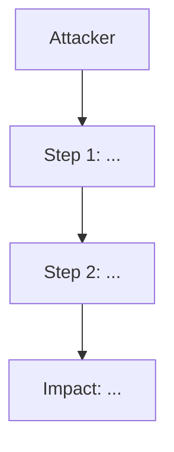

# Smart Contract Security Audit Skill

## Overview

This skill orchestrates a comprehensive smart contract security audit. It runs static analysis tools in parallel, detects the protocol type, spawns specialist sub-agents for deep manual review, validates findings through a skeptic/triager agent, generates Foundry PoCs for confirmed vulnerabilities, and consolidates everything into a severity-rated report.

**Multi-Run Strategy:** Run the full audit 2-3 times. Each run catches different things due to LLM attention variability. After all runs, UNION all findings and let the Triager deduplicate and adjudicate conflicts between runs. The final report should contain the best findings from all runs. See `references/multi-run-workflow.md` for the consolidation process.

## Workflow

### Step 1: Identify Target

Determine the audit target from the user's request:
- **Single file:** Path to a `.sol` file
- **Directory:** Path to a project directory (look for `src/`, `contracts/`)
- **GitHub repo:** Clone it first with `git clone`

Set `TARGET` to the resolved path. If a GitHub URL, clone to workspace first.

**Detect project framework:**
- `foundry.toml` exists → **Foundry** project
- `hardhat.config.js` or `hardhat.config.ts` exists → **Hardhat** project
- Neither → **Raw** Solidity files

### Step 2: Protocol Type Detection

Before any deep review, classify the protocol based on contract names, imports, and patterns:

| Type | Indicators |
|------|-----------|
| DeFi AMM/DEX | Swap functions, liquidity pools, `getAmountOut`, constant-product math |
| Lending/Borrowing | Borrow/repay functions, collateral factors, liquidation logic, interest rates |
| Stablecoin/Pegged Asset | Mint/redeem at peg, collateral ratio, reserve backing, price caps |
| Yield Vault/Staking | ERC4626, share/asset math, yield streams, cooldowns, staking rewards |
| Bridge/Cross-chain | Message passing, merkle proofs, relay, lock/unlock patterns |
| NFT/Gaming | ERC721/1155, metadata, randomness, game state |
| Governance/DAO | Proposals, voting, timelock, delegation, quorum |

A protocol can be multiple types (e.g., "Stablecoin + Yield Vault").

After classification, read `references/protocol-type-tricks.md` for the relevant section(s) and include those tricks in every specialist agent's prompt.

### Step 3: Install Tools

Run the install script:
```bash
bash scripts/install-tools.sh
```
If any tool fails to install, continue with available tools. The audit is still valuable with partial tooling.

### Step 4: Run Static Analysis (Parallel)

Run both tools simultaneously via exec:
```bash
bash scripts/run-slither.sh "$TARGET" audit-output &
bash scripts/run-aderyn.sh "$TARGET" audit-output &
wait
```

The scripts auto-detect Foundry/Hardhat and compile before analysis.

While tools run, proceed to Step 5.

### Step 5: Gather Protocol Context

Before any code review, read ALL documentation in the target repo thoroughly:
- README.md, docs/, any markdown files
- NatSpec comments in contracts
- Test files for intended behavior
- **Deploy scripts (`script/`, `deploy/`, `migrations/`) are HIGH PRIORITY scope.** They define the initial state of the protocol — sentinel values, unpaused contracts, missing configuration, ordering dependencies. Many real exploits happen in the deployment window.
- Review deploy scripts for: unpaused contracts with sentinel addresses, missing access control configuration, ordering dependencies (chicken-and-egg), hardcoded addresses, insufficient initialization

Build a **Protocol Summary** that captures:
- What the protocol does (token, lending, DEX, vault, etc.)
- Protocol type(s) detected in Step 2
- Contract architecture and inheritance hierarchy
- Trust model — who are the admins, operators, users?
- Token flows — minting, burning, transfers, fees
- External dependencies — oracles, DEXes, other protocols
- Upgrade patterns — proxies, migrations
- Key invariants the protocol should maintain

This summary gets passed to every specialist agent so they understand the protocol before auditing.

### Step 5.5: Test Coverage Analysis

If Foundry project: run `forge coverage --no-match-path 'test/fork/*' 2>/dev/null` in the target directory.
Parse the output table to identify functions/lines with low or zero coverage.
Feed coverage gaps to specialist agents: "Pay special attention to these UNCOVERED functions: [list]"

If Hardhat project: run `npx hardhat coverage 2>/dev/null` and parse similarly.

If the coverage tool fails (e.g., requires RPC, stack too deep), skip gracefully and document the limitation.

**Limitations:** `forge coverage` disables the optimizer and `viaIR`, which may cause "stack too deep" errors on complex contracts. Use `--ir-minimum` flag if needed. Fork tests requiring RPC will fail without network access.

### Step 5.6: Storage Layout Verification (Upgradeable Contracts)

If contracts use UUPS/TransparentProxy patterns:
1. Run `forge inspect <ContractName> storage-layout` for each upgradeable contract
2. Compare slot ordering between V1 and V2 implementations
3. Check for storage collisions (new variables inserted between existing slots)
4. Verify `__gap` arrays are correctly sized (should sum to a consistent total with used slots)
5. Report any storage layout mismatches as Critical findings

Save storage layout output for inclusion in the final report.

### Step 6: Read Source Code & Analyze Test Coverage

Read all Solidity source files in the target. Build understanding of:
- Contract architecture and inheritance
- External interactions (calls, delegatecalls, token transfers)
- State variables and access patterns
- Key business logic flows

**Test Coverage Analysis:**

Run coverage analysis to identify untested code paths:

- **Foundry projects:** Run `forge coverage` in the target directory. Parse the output table to identify functions/lines with low or zero coverage.
- **Hardhat projects:** Run `npx hardhat coverage` in the target directory. Parse the coverage report to identify gaps.
- **Raw files:** Skip coverage (no test framework).

Extract a **Coverage Gap Summary** listing:
- Functions with 0% branch coverage
- Functions with <50% line coverage
- Any uncovered code paths in critical functions (token transfers, minting, access control)

This summary gets passed to every specialist agent so they focus extra attention on untested code.

### Step 7: Spawn Specialist Agents

Spawn 6 specialist sub-agents in parallel. Each agent reviews the source code through a specific lens.

**General instructions for ALL agents:**
- Include the Protocol Summary from Step 5, the Coverage Gap Summary from Step 6, and the protocol-type-specific tricks from Step 2
- Include the full source code
- Instruct them to read their assigned reference file(s)
- **All agents should also read references/ethskills-security.md** — especially the "What You Probably Got Wrong" section as a sanity check
- **All agents should read references/forefy-vuln-patterns.md** for advanced patterns
- Agents must understand the protocol's intended behavior before flagging issues
- **Don't report generic patterns that are already mitigated. Focus on protocol-specific attack scenarios.**
- **Pay special attention to functions with low/no test coverage** (from the Coverage Gap Summary)
- **Report 'No findings' if you genuinely find nothing, rather than inventing low-quality issues.** Quality over quantity.
- **NEGATIVE EVIDENCE REQUIREMENT:** When NO findings are found in your area, you MUST document what was checked and why it's safe. Example: "Checked all 8 external calls — all protected by nonReentrant. Checked cross-contract reentrancy between StakingVault↔BuckEscrow — CEI followed, no callback opportunity." This goes into the Coverage Evidence section.
- **Tag every finding with its SWC ID** from references/swc-registry.md where applicable.

#### Agent 1: Reentrancy & State Management
```
Review this Solidity code for reentrancy vulnerabilities and state management issues.
Read references/vulnerability-patterns.md, references/cyfrin-checklist.md, and references/forefy-vuln-patterns.md (FV-SOL-1 section) for patterns.

Don't report generic patterns that are already mitigated. Focus on protocol-specific attack scenarios.
Pay special attention to functions with low/no test coverage.
Report 'No findings' if you genuinely find nothing, rather than inventing low-quality issues.
NEGATIVE EVIDENCE: If no findings, document what was checked and why it's safe.
Tag findings with SWC IDs (SWC-107 for reentrancy).

Check for:
- State changes after external calls (CEI violations)
- Cross-contract reentrancy via shared state
- Read-only reentrancy in view functions
- ERC-777/ERC-721 callback reentrancy
- Missing ReentrancyGuard on state-changing functions
- Inconsistent state during external calls
- Check if existing reentrancy guards are correctly placed and cover ALL entry points
- Check cross-contract reentrancy: can re-entering through Contract B manipulate shared state in Contract A?
- Transient storage reentrancy guard limitations (EIP-1153)

For each finding, provide:
- Severity (Critical/High/Medium/Low/Info)
- Location (file:line)
- Description of the vulnerability
- Proof of concept attack scenario
- Recommended fix
- SWC Classification
```

#### Agent 2: Access Control & Authorization
```
Review this Solidity code for access control and authorization vulnerabilities.
Read references/cyfrin-checklist.md, references/owasp-sc-top10.md, and references/forefy-vuln-patterns.md (FV-SOL-4 section) for patterns.

Don't report generic patterns that are already mitigated. Focus on protocol-specific attack scenarios.
Pay special attention to functions with low/no test coverage.
Report 'No findings' if you genuinely find nothing, rather than inventing low-quality issues.
NEGATIVE EVIDENCE: If no findings, document what was checked and why it's safe.
Tag findings with SWC IDs (SWC-100, SWC-105, SWC-106, SWC-112, SWC-115).

Check for:
- Missing access modifiers on privileged functions
- Improper use of tx.origin
- Unprotected initializers
- Two-step ownership transfer missing
- Privilege escalation paths
- Exposed parent contract functions
- Centralization risks (single admin key)
- Map the full privilege hierarchy. Identify what damage each role can do.
- Check for privilege escalation chains — can a lower-privilege role gain higher privileges through a sequence of calls?
- Verify role separation — are there functions that should require multi-sig but don't?
- UUPS upgrade authorization — is _authorizeUpgrade properly restricted?
- Initialization front-running on deploy

For each finding, provide severity, location, description, attack scenario, and fix.
```

#### Agent 3: Oracle & Price Manipulation
```
Review this Solidity code for oracle and price manipulation vulnerabilities.
Read references/owasp-sc-top10.md, references/vulnerability-patterns.md, and references/forefy-vuln-patterns.md (FV-SOL-10 section) for patterns.

Don't report generic patterns that are already mitigated. Focus on protocol-specific attack scenarios.
Pay special attention to functions with low/no test coverage.
Report 'No findings' if you genuinely find nothing, rather than inventing low-quality issues.
NEGATIVE EVIDENCE: If no findings, document what was checked and why it's safe.
Tag findings with SWC IDs (SWC-120 for weak randomness).

Check for:
- Spot price from DEX pools (flash-loan manipulable)
- Missing TWAP or Chainlink usage
- Stale oracle data (no heartbeat check)
- Missing L2 sequencer uptime checks
- Single oracle dependency
- Price derived from token balance ratios
- Read-only reentrancy on price feeds (Curve get_virtual_price)
- If no external oracle is used, analyze internal price computation for manipulation vectors
- Check if any exchange rate, share price, or conversion ratio can be manipulated within a single transaction
- Chainlink staleness, L2 sequencer, TWAP manipulation cost

For each finding, provide severity, location, description, attack scenario, and fix.
```

#### Agent 4: Flash Loan & Economic Attacks
```
Review this Solidity code for flash loan and economic attack vectors.
Read references/owasp-sc-top10.md, references/vulnerability-patterns.md, references/ethskills-security.md (DeFi Composability Attack Surfaces section), and references/forefy-vuln-patterns.md for patterns.

Don't report generic patterns that are already mitigated. Focus on protocol-specific attack scenarios.
Pay special attention to functions with low/no test coverage.
Report 'No findings' if you genuinely find nothing, rather than inventing low-quality issues.
NEGATIVE EVIDENCE: If no findings, document what was checked and why it's safe.
Tag findings with SWC IDs (SWC-114 for front-running/MEV).

Check for:
- Governance votes based on current balance (flash loan voting)
- Share/LP calculations manipulable in single transaction
- First depositor inflation attacks (ERC4626 vaults)
- Donation attacks via direct token transfer
- Sandwich attack vectors (missing slippage protection)
- Front-running opportunities in two-step processes
- Economic invariant violations
- Analyze share/token math for single-transaction manipulation
- Check vault accounting — can depositing and withdrawing in the same block extract value?
- Check if any ratio (shares/assets, exchange rates) can be skewed by a large deposit or donation

For each finding, provide severity, location, description, attack scenario, and fix.
```

#### Agent 5: Gas Optimization & DoS Vectors
```
Review this Solidity code for gas optimization issues and denial-of-service vectors.
Read references/cyfrin-checklist.md and references/forefy-vuln-patterns.md (FV-SOL-9 section) for patterns.

Don't report generic patterns that are already mitigated. Focus on protocol-specific attack scenarios.
Pay special attention to functions with low/no test coverage.
Report 'No findings' if you genuinely find nothing, rather than inventing low-quality issues.
NEGATIVE EVIDENCE: If no findings, document what was checked and why it's safe.
Tag findings with SWC IDs (SWC-113, SWC-126, SWC-128).

Check for:
- Unbounded loops (block gas limit DoS)
- External calls in loops (single failure reverts all)
- Push-based payment patterns (should be pull-based)
- Storage reads in loops (cache in memory)
- Missing minimum amounts (dust spam)
- Forced queue processing attacks
- Token blacklist causing permanent DoS
- Focus on operational DoS — scenarios where admin misconfiguration or external dependency failure blocks user funds
- What happens if an external contract (oracle, DEX, bridge) goes down? Are user funds stuck?
- Can admin accidentally set a parameter that bricks the protocol?

For each finding, provide severity, location, description, attack scenario, and fix.
```

#### Agent 6: Logic Errors & Edge Cases
```
Review this Solidity code for logic errors, math issues, and edge cases.
Read references/cyfrin-checklist.md, references/trailofbits-methodology.md, references/ethskills-security.md (Incentive Design Framework section), and references/forefy-vuln-patterns.md (FV-SOL-2, FV-SOL-3, FV-SOL-5 sections) for patterns.
For every state transition, ask: "Who calls this? Why would they? Is the incentive sufficient?"

Don't report generic patterns that are already mitigated. Focus on protocol-specific attack scenarios.
Pay special attention to functions with low/no test coverage.
Report 'No findings' if you genuinely find nothing, rather than inventing low-quality issues.
NEGATIVE EVIDENCE: If no findings, document what was checked and why it's safe.
Tag findings with SWC IDs where applicable.

THIS IS THE MOST IMPORTANT REVIEW. Be thorough.

Check for:
- Division before multiplication (precision loss)
- Rounding in wrong direction
- Off-by-one errors in loops and comparisons
- Incorrect type casting (uint256→uint128, int→uint)
- Fee-on-transfer token assumptions
- Rebasing token assumptions
- Wrong variable used in calculations
- Missing zero-amount/zero-address checks
- Unchecked return values
- Signature replay / malleability
- Proxy storage layout mismatches
- Check every math operation for overflow/underflow edge cases
- Check every state transition for correctness
- Compare mint vs redeem paths for asymmetry — do users get back exactly what they put in (minus fees)?
- Check boundary conditions: first deposit, last withdrawal, zero balance, max uint values
- Verify fee calculations don't create rounding exploits at small or large amounts
- Epoch boundary bugs in time-based calculations

For each finding, provide severity, location, description, attack scenario, and fix.
```

### Step 8: Collect Results

Wait for all sub-agents and tool runs to complete. Gather:
1. Static analysis outputs from `audit-output/`
2. Findings from each specialist agent
3. Coverage evidence from agents that found nothing

### Step 9: Triager / Skeptic Agent (Agent 7)

**This is the most critical quality step.** After collecting all findings, spawn a 7th "Triager" agent that reviews every Medium+ finding.

```
You are a senior security triager. Your job is to CHALLENGE every finding.
You will receive all Medium+ findings from 6 specialist agents. For EACH finding:

1. Is this actually exploitable in practice? What are the prerequisites?
   - Does the attacker need admin access? (If yes, it's at most Medium — admin trust is assumed)
   - Does the attacker need specific contract state? How likely is that state?
   - Is there a time window? How narrow?

2. Is the attack economically rational? Calculate:
   - Gas cost of the attack (approximate tx gas * gas price)
   - Capital required (flash loans, collateral, etc.)
   - Expected profit
   - If profit < gas cost, it's not economically viable

3. Does the severity match?
   - A theoretical attack requiring admin key compromise is NOT Critical
   - A race condition with a 1-block window on a 12-second chain is harder to exploit than stated
   - Loss of dust amounts (<$1) from rounding is Informational, not Medium
   - Issues that require protocol to be in an unusual state should be downgraded

4. Are there existing mitigations the auditor missed?
   - Check if the issue is already handled by another contract in the system
   - Check if access controls prevent the attack path
   - Check if economic parameters (fees, caps, delays) make the attack unprofitable

5. Mark each finding as:
   - VALID: Undeniable vulnerability, severity is correct
   - QUESTIONABLE: Needs more proof or specific conditions not adequately described
   - DISMISSED: Not exploitable in practice or already mitigated
   - OVERCLASSIFIED: Real issue but wrong severity — suggest correct severity

For each finding, provide:
- Triager verdict (VALID/QUESTIONABLE/DISMISSED/OVERCLASSIFIED)
- If OVERCLASSIFIED, suggested severity
- Economic feasibility analysis (gas cost, capital, profit estimate)
- Attack prerequisites list
- Mitigations the original auditor may have missed
- Confidence level (HIGH/MEDIUM/LOW)
```

Pass the triager ALL Medium+ findings along with the full source code and protocol summary. The triager must have enough context to independently verify each finding.

### Step 10: Foundry PoC Generation

For each finding marked VALID by the triager at Medium+ severity:

**Generate Foundry PoCs for ALL Medium+ findings, even if the attack only requires an admin call.** A one-liner PoC like `vm.prank(admin); reserve.setAdminDelaySeconds(0); assertEq(reserve.adminDelaySeconds(), 0);` still demonstrates the issue concretely and proves the fix works. Never skip PoC generation because an attack is "trivial."

1. Check if `foundry.toml` exists in the target
2. If yes, generate a Foundry test file demonstrating the vulnerability:
   - Include contract setup (deploy, configure, fund)
   - Attack sequence (step-by-step calls)
   - Assertions proving the vulnerability (balance changes, state corruption, etc.)
3. Save to `audit-output/poc/` directory

Template:
```solidity
// SPDX-License-Identifier: MIT
pragma solidity ^0.8.0;

import "forge-std/Test.sol";
// import target contracts

contract PoC_FINDING_ID is Test {
    // State variables for contracts

    function setUp() public {
        // Deploy and configure contracts
    }

    function test_exploit() public {
        // Step 1: Setup attack conditions
        // Step 2: Execute attack
        // Step 3: Assert vulnerability impact
    }
}
```

After generating PoCs, run `forge test --match-path 'audit-output/poc/*' --gas-report` to measure actual gas costs. Include gas measurements in the Economic Feasibility section of each finding. If PoCs are in a separate directory, adjust the path accordingly.

### Step 11: Multi-Run Consolidation

If this is run 2 or 3, read findings from previous runs and merge:
- Deduplicate identical findings (same location, same vulnerability)
- If severity differs between runs, the Triager decides the final severity
- Include findings that appeared in only one run (they may represent real issues caught by different attention patterns)
- Document which findings appeared in which runs in the Multi-Run Notes section

See `references/multi-run-workflow.md` for detailed consolidation process.

### Step 12: Cross-Reference Solodit

For each Medium+ finding (VALID or QUESTIONABLE from triager), search Solodit (https://solodit.cyfrin.io/) for similar findings from real audits. Use web_search with queries like `site:solodit.cyfrin.io [vulnerability type] [contract pattern]`.

If a matching finding exists from a real audit, include the Solodit reference link in the finding. This adds credibility to the report and helps developers understand that the issue class has been exploited or flagged before.

### Step 13: Generate Final Report

Use this report template:

---

## Audit Report Template

```markdown
# Smart Contract Security Audit Report

## Executive Summary
- **Target:** [contract name/path]
- **Date:** [date]
- **Auditor:** OpenClaw Automated Audit
- **Scope:** [files audited]
- **Methods:** Slither + Aderyn static analysis + 6 specialist reviews + triager validation
- **Framework:** [Foundry/Hardhat/Raw]
- **Protocol Type:** [detected type(s)]

## Risk Summary
| Severity | Count |
|----------|-------|
| Critical | X |
| High | X |
| Medium | X |
| Low | X |
| Informational | X |

## Findings

### [C-01] Title
**Severity:** Critical
**Location:** `file.sol:L42`
**Found by:** [Agent/Tool]
**SWC Classification:** SWC-XXX (Name)
**Solodit Reference:** [link if matching finding exists]

**Description:**
[Clear description of the vulnerability]

**Impact:**
[What can go wrong, estimated loss potential]

**Proof of Concept:**
[Step-by-step attack scenario or code]

**Attack Flow:**


**Economic Feasibility:**
- Gas cost: [estimate]
- Capital required: [estimate]
- Expected profit: [estimate]

**Triager Validation:**
- **Verdict:** [VALID/QUESTIONABLE/DISMISSED/OVERCLASSIFIED]
- **Assessment:** [triager's analysis]
- **Confidence:** [HIGH/MEDIUM/LOW]

**Recommendation:**
[Specific code fix]

---

[Repeat for each finding, ordered by severity]

## Coverage Evidence

### Agent 1 (Reentrancy & State Management)
[What was checked, what was found safe, and why]

### Agent 2 (Access Control & Authorization)
[What was checked, what was found safe, and why]

### Agent 3 (Oracle & Price Manipulation)
[What was checked, what was found safe, and why]

### Agent 4 (Flash Loan & Economic Attacks)
[What was checked, what was found safe, and why]

### Agent 5 (Gas Optimization & DoS Vectors)
[What was checked, what was found safe, and why]

### Agent 6 (Logic Errors & Edge Cases)
[What was checked, what was found safe, and why]

## Gas Optimizations
[List gas optimization findings]

## Informational
[List informational findings]

## Static Analysis Summary
- **Slither:** [X high, Y medium, Z low findings — key items listed]
- **Aderyn:** [X high, Y low findings — key items listed]

## Test Coverage Gaps
[Functions/lines with 0% coverage from `forge coverage`, highlighted for review]

## Storage Layout Verification
[Slot-by-slot comparison for upgradeable contracts. Verify __gap sizing and slot ordering.]

## Multi-Run Notes
[Which findings appeared in which runs, consolidation decisions, severity conflicts resolved]

## Foundry PoCs
[List generated PoC files and what they demonstrate]

## Disclaimer
This is an automated audit and should not be considered a substitute for a professional manual security review. Always engage experienced auditors for production deployments.
```

---

## Severity Definitions

- **Critical:** Direct loss of funds, contract takeover, or permanent DoS with no workaround. Exploitable now.
- **High:** Significant loss of funds or functionality under specific but realistic conditions.
- **Medium:** Loss of funds or functionality under unlikely conditions, or significant governance/centralization risk.
- **Low:** Minor issues, best practice violations, or edge cases with minimal impact.
- **Informational:** Code quality, gas optimization, or style suggestions.

## Notes

- Scripts auto-detect Foundry/Hardhat/Raw projects and adapt accordingly
- For large codebases (>20 files), prioritize core protocol contracts over periphery/tests
- Always read the protocol's documentation/README for intended behavior before flagging logic issues
- False positives from tools should be filtered out — verify each finding against source code
- Test coverage gaps should inform where agents focus their deepest review
- The triager agent is the quality gate — findings that don't survive triaging should be downgraded or removed
- Every agent must produce coverage evidence even when no findings are found
- All findings should be tagged with SWC IDs for standardized classification
- Medium+ findings must include mermaid attack flow diagrams and economic feasibility analysis
