# Backstage Skill

**Nickname:** `backstage:`

**Objective:** Universal project status management for AI-assisted development. Ensures documentation matches reality before every commit.

---

## 🔴 Why This Skill Exists (Anti-Drift)

**Backstage-skill = ANTI-DRIFT:**
- ✅ Force context awareness (project/epic)
- ✅ HEALTH checks prevent chaos
- ✅ Architecture-first workflow
- ✅ Roadmap visibility = no surprises

**WITHOUT IT:**  
Work happens outside backstage → drift → broken trust → triple metabolic cost

**WITH IT:**  
"good morning X" → automatic context load → work inside boundaries → paridade maintained

---

**The Metabolic Cost Problem:**

Without backstage, delegation costs **triple**:
1. The work itself
2. Explicating methodology (ethics, preferences, protocols)
3. Defining WHERE that learning gets stored (VISION? SOUL? SKILL? memory?)

This is **exhausting** for the human.

**Investment is worth it ONLY IF plateau is reached:**
- Human teaches ONCE → AI internalizes
- Each session: READ context files → act according to ethics
- Each session: LESS explanation needed
- Plateau = Human delegates, AI executes without supervision

**This skill enforces stabilization.**  
Force context awareness (project/epic/design architecture) to prevent drift.  
**3x work becomes 1x work.**

---

## POLICY & HEALTH Enforcement

**Backstage-skill enforces ALL rules in POLICY.md and HEALTH.md (global + project).**

### Enforcement Model

```mermaid
flowchart TD
    START[Read POLICY + HEALTH<br/>global + project]
    CONFLICT{Conflict?}
    MERGE[Merge compatible rules]
    PROJECT[Project wins]
    
    SEPARATE[Separate enforcement types]
    EXEC[Executable<br/>Deterministic rules]
    INTERP[Interpretive<br/>Contextual rules]
    
    SH[checks.sh executes]
    SH_OK[✅ Enforced]
    SH_FAIL[❌ Error reported]
    
    AI[AI interprets + acts]
    AI_ACT[✅ Enforce or discuss]
    AI_AMBIG[⚠️ Ask user]
    AI_FAIL[❌ Needs rewrite]
    
    REPORT[Integrated report]
    
    START --> CONFLICT
    CONFLICT -->|No| MERGE
    CONFLICT -->|Yes| PROJECT
    MERGE --> SEPARATE
    PROJECT --> SEPARATE
    
    SEPARATE --> EXEC
    SEPARATE --> INTERP
    
    EXEC --> SH
    SH -->|Success| SH_OK
    SH -->|Fail| SH_FAIL
    
    INTERP --> AI
    AI -->|Clear| AI_ACT
    AI -->|Ambiguous| AI_AMBIG
    AI -->|Can't parse| AI_FAIL
    
    SH_OK --> REPORT
    SH_FAIL --> REPORT
    AI_ACT --> REPORT
    AI_AMBIG --> REPORT
    AI_FAIL --> REPORT
```



**Two enforcement domains:**

1. **Executable (Deterministic)**
   - Code blocks in HEALTH.md
   - Templates in POLICY.md (navigation blocks, versions)
   - File structure rules (must have 🤖 markers)
   - **Enforced by:** checks.sh (extracts + executes)

2. **Interpretive (Contextual)**
   - Prose rules in POLICY.md
   - Quality guidelines ("surgical changes", "clear and prompt-like")
   - Context decisions ("README is special")
   - **Enforced by:** AI (reads + interprets + acts/discusses)

**Guarantee:** EVERY rule is attempted (executable → SH, interpretive → AI). Failures reported to user.

**Self-contained:** All prompts in SKILL.md (no external prompt files needed).

---

## Mermaid Diagram Generation (Interpretive)

**Purpose:** Automatically generate + propagate ROADMAP diagram to all backstage files.

**Workflow:**

1. **Parse ROADMAP.md** (deterministic - SH):
   ```bash
   parse-roadmap.sh backstage/ROADMAP.md
   # Output: version|status_emoji|name
   ```

2. **Read POLICY diagram rules** (interpretive - AI):
   - Global POLICY.md defines default format (linear graph, all epics, sequential)
   - Project POLICY.md can override (gantt, flowchart, or `diagram: none`)
   - Project wins on conflict

3. **Generate mermaid** (interpretive - AI):
   - Apply POLICY rules to parsed data
   - Create mermaid syntax matching specification
   - Example (default):
     ```mermaid
     graph LR
         A[🏗️ v0.1.0 Active Epic] --> B[📋 v0.2.0 Backlog Epic]
     ```

4. **Propagate to all files** (deterministic - SH):
   - Insert after `> 🤖` marker
   - README.md, ROADMAP.md, CHANGELOG.md, POLICY.md, HEALTH.md
   - Remove old diagrams (anti-drift)

**AI Prompt (when running backstage-start/end):**

> Read global/POLICY.md and project/POLICY.md mermaid diagram rules.
> Run `parse-roadmap.sh` to extract epics.
> Generate mermaid diagram following POLICY rules (prefer project over global).
> Insert diagram after navigation block (`> 🤖`) in all backstage files.
> If project POLICY says `diagram: none`, skip generation.

**Tools:**
- `parse-roadmap.sh` - Extract version|status|name from ROADMAP.md
- POLICY.md - Diagram format rules (type, include/exclude logic, status mapping)

---

## Polycentric Governance (How It Works)


**This skill enforces polycentric governance:**
- Reads BOTH global + project POLICY/HEALTH files
- Merges when compatible
- Prefers project rules on conflict
- Executes workflow based on merged understanding

**Triggered by:** "good morning", "good night", "backstage start/end"

---

## Workflow Diagram

```mermaid
flowchart TD
    START["Trigger 1️⃣<br/>[SH]"]
    MODE{"Session mode?"}
    
    %% Common checks module (expanded)
    CHECKS["checks.sh 6️⃣"]
    READ_POLICY["Read POLICY<br/>global + project<br/>[AI reads MD]"]
    READ_HEALTH["Read HEALTH<br/>global + project<br/>[AI reads MD]"]
    
    SEPARATE["Separate enforcement<br/>[AI logic]"]
    EXEC["Executable rules<br/>[SH domain]"]
    INTERP["Interpretive rules<br/>[AI domain]"]
    
    SH_EXEC["Execute deterministic<br/>[SH runs]"]
    AI_INTERP["Interpret contextual<br/>[AI acts/discusses]"]
    
    INTEGRATE["Integrated report<br/>[AI formats]"]
    CHECKS_GATE{"All pass?"}
    
    %% Start Branch
    START_BRANCH["Read README 🤖 block 2️⃣<br/>[MD → AI]"]
    START_FILES["Locate status files 3️⃣<br/>[SH]"]
    START_GIT["Check git branch 4️⃣<br/>[SH]"]
    START_WORK["Analyze changes 5️⃣<br/>[SH]"]
    START_FIX["🛑 STOP: Fix issues<br/>[AI + SH]"]
    START_UPDATE["Update docs 7️⃣<br/>[SH writes MD]"]
    START_REPORT["Developer context 8️⃣<br/>[AI reads MD]"]
    START_PUSH["Push / Groom 9️⃣<br/>[SH]"]
    
    %% End Branch
    END_FIXES["Add fixes to roadmap<br/>[AI writes MD]"]
    END_PUSH["Commit + push<br/>[SH]"]
    END_VICTORY["Victory lap 🏆<br/>[AI reads MD]"]
    END_BODY["Body check ⏸️<br/>[AI prompt]"]
    END_CLOSE["Close VS Code 🌙<br/>[SH]"]
    END_SILENT["[STAY SILENT]"]
    
    %% Flow
    START --> MODE
    
    MODE -->|Start| START_BRANCH
    START_BRANCH --> START_FILES
    START_FILES --> START_GIT
    START_GIT --> START_WORK
    START_WORK --> CHECKS
    
    CHECKS --> READ_POLICY
    CHECKS --> READ_HEALTH
    READ_POLICY --> SEPARATE
    READ_HEALTH --> SEPARATE
    
    SEPARATE --> EXEC
    SEPARATE --> INTERP
    
    EXEC --> SH_EXEC
    INTERP --> AI_INTERP
    
    SH_EXEC --> INTEGRATE
    AI_INTERP --> INTEGRATE
    INTEGRATE --> CHECKS_GATE
    
    CHECKS_GATE -->|No, start mode| START_FIX
    START_FIX --> CHECKS
    CHECKS_GATE -->|Yes| START_UPDATE
    START_UPDATE --> START_REPORT
    START_REPORT --> START_PUSH
    
    MODE -->|End| CHECKS
    CHECKS_GATE -->|No, end mode| END_FIXES
    CHECKS_GATE -->|Yes| END_PUSH
    END_FIXES --> END_VICTORY
    END_PUSH --> END_VICTORY
    END_VICTORY --> END_BODY
    END_BODY --> END_CLOSE
    END_CLOSE --> END_SILENT
```



**Domain labels:**
- **[MD]** - Markdown file (POLICY.md, HEALTH.md, ROADMAP.md) = Human/AI prompts
- **[SH]** - Shell script (checks.sh, backstage-start.sh) = Machine executables
- **[AI reads MD]** - AI parses markdown, understands rules/prompts
- **[AI writes MD]** - AI generates markdown content
- **[SH writes MD]** - Script modifies markdown files (checkboxes, navigation blocks)
- **[SH runs]** - Script executes deterministic rules
- **[AI acts/discusses]** - AI interprets contextual rules, enforces or asks user
- **[AI logic]** - AI separates executable from interpretive

**Critical separation:**
- **MD files are prompts** - AI reads, interprets, acts
- **SH files are executors** - Bash runs commands directly
- **AI intermediates** - Reads POLICY/HEALTH, separates enforcement types, calls SH for deterministic rules, handles contextual rules itself

**Notes:**

**1️⃣ Trigger:** "backstage start", "vamos trabalhar no X", "whatsup" (start mode) OR "backstage end", "boa noite", "wrap up" (end mode)
- **Code:** `backstage-start.sh` OR `backstage-end.sh`

**2️⃣ Read README 🤖 block:** Find navigation block between `> 🤖` markers. Extract all status file paths (ROADMAP, CHANGELOG, HEALTH, POLICY). This is ONLY source of truth for file locations.
- **Code:** `backstage-start.sh::read_navigation_block()`

**3️⃣ Locate status files:** Use paths from 🤖 block. If missing, STOP and ask user where to create them. Check BOTH global (`backstage/global/`) and project (`backstage/`) for polycentric governance.
- **Code:** `backstage-start.sh::locate_status_files()`

**4️⃣ Check git branch:** Run `git branch --show-current`. Determine work context.
- **Code:** `backstage-start.sh::check_branch()`

**5️⃣ Analyze changes:** 
```bash
git diff --name-status
git diff --stat
LAST_VERSION=$(grep -m1 "^## v" CHANGELOG.md | cut -d' ' -f2)
git log --oneline "${LAST_VERSION}..HEAD"
```
Categorize: patch/minor/major. Compare with ROADMAP. Match reality to plans.
- **Code:** `backstage-start.sh::analyze_changes()`

**6️⃣ checks.sh - Unified POLICY + HEALTH enforcement:**
1. **Read POLICY** (global + project, project wins)
2. **Enforce POLICY** - Detect doc drift (system ≠ docs), fix docs
3. **Read HEALTH** (global + project, project wins)
4. **Run HEALTH checks** - Execute tests
5. **Fix what we can** (bugs, connection issues, missing files)
6. **Report errors** (what we CAN'T fix)

**Mode behavior:**
- **Start mode:** Hard fail (block commit if checks fail)
- **End mode:** Soft fail (warn, add to ROADMAP)

- **Code:** `checks.sh` (called by both start/end)

**7️⃣ Update docs:** If checks pass, auto-update ROADMAP (mark checkboxes) and CHANGELOG (add new entries at TOP, append-only). Bump version. Add navigation menu to all status files.
- **Code:** `backstage-start.sh::update_docs()`

**8️⃣ Developer context:** Generate outcome-based summary (5 possible states: 🛑 Failed, ⚠️ Mismatch, 🧑 Grooming, ✅ Progress, 🎉 Complete). Show: When, What, Why, Status, Next.
- **Code:** `backstage-start.sh::show_developer_context()`

**9️⃣ Push / Groom:** If checks passed, commit with appropriate message (progress/release). If grooming mode, just update ROADMAP priorities.
- **Code:** `backstage-start.sh::prompt_push()`

**Victory lap 🏆:** Brief reminder of achievements (3 main items max + stats). Keep it short.
- **Code:** `backstage-end.sh::victory_lap()`

**Body check ⏸️:** Ask: Hungry? Thirsty? Tired? Need to stretch? What does body NEED right now?
- **Code:** `backstage-end.sh::body_check()`

**Close VS Code 🌙:** Run countdown + `osascript -e 'quit app "Visual Studio Code"'`. CRITICAL: Agent must NOT send ANY message after this or VS Code will prompt "unsaved changes".
- **Code:** `backstage-end.sh::close_vscode()`

**[STAY SILENT]:** No reply after closing VS Code (prevents unsaved prompt).

---

## When to Use

**Trigger patterns:**

**Start mode:**
- "backstage start"
- "whatsup"
- "vamos trabalhar no X"
- "what's the status"
- Before every commit (especially after long breaks)

**End mode:**
- "backstage end"
- "boa noite"
- "wrap up"
- "pause work"
- End of work session, when tired, or context-switch

---

## Key Principles

1. **README's 🤖 block = Single source of truth** for file locations
2. **Status files = AI prompts** (HEALTH = tests, POLICY = rules, ROADMAP = backlog, CHANGELOG = history)
3. **Polycentric governance** (global + project rules, project wins on conflict)
4. **Checks must pass** before commit (non-negotiable for start mode, soft fail for end mode)
5. **CHANGELOG is append-only** (never edit old entries, add NEW entry for corrections)
6. **5 possible outcomes** (Failed, Mismatch, Grooming, Progress, Complete)
7. **Documentation auto-syncs** with reality (mark checkboxes, bump versions, move epics)
8. **Body check at end** (mental health + momentum preservation)
9. **Silent after VS Code close** (prevent unsaved prompt)
10. **Works on ANY project** (no hardcoded paths, reads README first)

---

## The 5 States (Start Mode)

| State               | When         | Action            | Can Push? |
|---------------------|--------------|-------------------|-----------|
| 🛑 Failed Checks    | Tests fail   | Fix issues        | ❌ NO     |
| ⚠️ Docs Mismatch    | Code ≠ docs  | Auto-update docs  | ✅ YES    |
| 🧑 Grooming         | No changes   | Plan next work    | N/A       |
| ✅ In Progress      | Partial work | Update checkboxes | ✅ YES    |
| 🎉 Version Complete | All done!    | Move to CHANGELOG | ✅ YES 🎉 |

---

## Check Policy

**From HEALTH.md:**

- **Epic branches:** Soft fail (warn but allow)
- **Main branch:** Hard fail (block merge)
- **Wrap-up (end mode):** Soft fail (list fixes, don't push)

---

## The 3-Level System

**Level 1: Personal** (not tracked)
- Your books, notes, local config
- Not part of any project

**Level 2: Project-Specific** (e.g., Librarian MCP)
- Generic tool others can use
- Has status files (ROADMAP, CHANGELOG, HEALTH, POLICY)
- Example flagship project for Level 3

**Level 3: Meta-Workflow** (this skill)
- Works for ANY project
- No hardcoded paths
- Reads README to find everything
- Can be copied anywhere

---

## Reference Prompts

**Original prompts (for future refinement):**
- `backstage-start.prompt.md` - Full start workflow specification
- `backstage-close.prompt.md` - Full end workflow specification

**Location:** `/Users/nfrota/Documents/nonlinear/.github/prompts/`

**Note:** This SKILL.md is a DRAFT distillation of those prompts. Future refinements will improve diagram, add emoji notes, clarify steps. The original prompts contain ALL details.

---

## TODO / Future Refinements

- [ ] **Add emoji notes** (like design-discrepancy 1️⃣-8️⃣ format)
- [ ] **Simplify diagram** (too many nodes, need consolidation)
- [ ] **Add code execution points** (where scripts run, if any)
- [ ] **Create templates** (for new projects without status files)
- [ ] **Document edge cases** (no git, no README, corrupted files)
- [ ] **Add examples** (successful runs, failed runs, grooming sessions)
- [ ] **Test on multiple projects** (validate universal workflow)
- [ ] **Consider splitting** (start vs end as separate skills?)

---

**Created:** 2026-02-12
**Status:** DRAFT (needs refinement)
**Location:** `~/Documents/skills/backstage/SKILL.md`
