# TreeListy Skill for OpenClaw

Hierarchical decomposition and project planning for OpenClaw agents. Zero token cost — all operations are local pattern transforms.

## Installation

```bash
# Clone or download to your OpenClaw skills directory
git clone https://github.com/prairie2cloud/treelisty-openclaw-skill.git ~/.openclaw/skills/treelisty

# Install dependencies
cd ~/.openclaw/skills/treelisty && npm install
```

## Quick Start

```bash
# List all 21 patterns
node scripts/treelisty-cli.js patterns

# Decompose a topic
node scripts/treelisty-cli.js decompose --pattern roadmap --input "Build a SaaS product" --format json

# Export to Mermaid diagram
node scripts/treelisty-cli.js export --input tree.json --format mermaid
```

## Commands

| Command | Description |
|---------|-------------|
| `patterns` | List all 21 hierarchical patterns |
| `decompose` | Convert text/outline to structured tree JSON |
| `export` | Convert tree to Markdown/Mermaid/CSV/HTML |
| `validate` | Quality scoring and pattern compliance |
| `push` | Send to live TreeListy instance (optional) |

## Patterns

21 specialized patterns for different domains:

- **📋 generic** — Universal project structure
- **🚀 roadmap** — Product feature planning
- **💼 sales** — Sales pipeline tracking
- **🎓 thesis** — Academic writing
- **📚 book** — Novel/screenplay structure
- **🎉 event** — Event planning
- **📊 strategy** — Business strategy
- **📖 course** — Educational curricula
- **🎬 film** — AI video production
- **🤔 philosophy** — Philosophical arguments
- **🧠 prompting** — Prompt engineering
- **💰 capex** — Capital expenditure / investor pitch
- And 11 more...

See `references/PATTERNS.md` for full documentation.

## Example Output

```mermaid
flowchart TB
    N0([🚀 Q1 Product Launch])
    N1[Research]
    N0 --> N1
    N2(Market analysis)
    N1 --> N2
    N3(Competitor review)
    N1 --> N3
    N4[Development]
    N0 --> N4
    N5(Core features)
    N4 --> N5
```



## Security

- No API keys required
- No external network calls (except optional `push` to localhost)
- No data collection or telemetry
- Apache-2.0 licensed

## Requirements

- Node.js 18+
- No other dependencies (ws only for optional push)

## Links

- [TreeListy Web App](https://treelisty.com)
- [Full Pattern Reference](references/PATTERNS.md)
- [SKILL.md](SKILL.md) — OpenClaw skill manifest

## License

Apache-2.0 — Prairie2Cloud LLC
