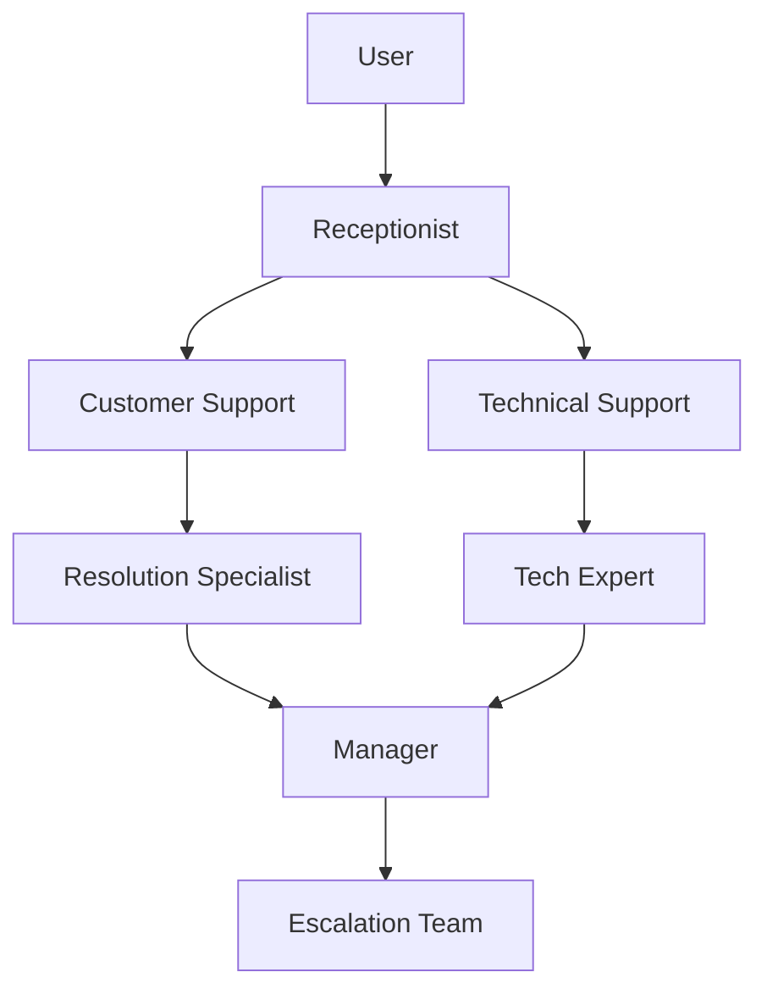
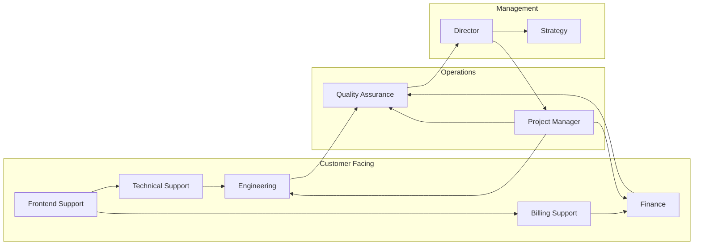

# Multi-Agent Role Templates

This document provides reusable role templates for various multi-agent system configurations.

## Basic Role Template

```json
{
  "id": "role_name",
  "name": "Role Name",
  "description": "Detailed role description",
  "expertise": [
    "Skill 1",
    "Skill 2",
    "Skill 3"
  ],
  "responsibilities": [
    "Responsibility 1",
    "Responsibility 2",
    "Responsibility 3"
  ],
  "communication": {
    "inbound": ["role1", "role2"],
    "outbound": ["role3", "role4"]
  },
  "performance": {
    "metrics": [
      "Metric 1",
      "Metric 2"
    ],
    "targets": {
      "metric1": "Target value",
      "metric2": "Target value"
    }
  }
}
```

## Industry-Specific Role Templates

### Healthcare

#### Medical Diagnostician
```json
{
  "id": "medical_diagnostician",
  "name": "Medical Diagnostician",
  "description": "Analyzes patient data and provides diagnostic recommendations",
  "expertise": [
    "Medical knowledge",
    "Data analysis",
    "Diagnostic reasoning"
  ],
  "responsibilities": [
    "Review patient symptoms",
    "Analyze test results",
    "Provide preliminary diagnoses",
    "Recommend treatment options"
  ],
  "communication": {
    "inbound": ["patient_intake"],
    "outbound": ["treatment_planner"]
  },
  "performance": {
    "metrics": [
      "Diagnostic accuracy",
      "Time to diagnosis"
    ],
    "targets": {
      "diagnostic_accuracy": "95%",
      "time_to_diagnosis": "24 hours"
    }
  }
}
```

#### Treatment Planner
```json
{
  "id": "treatment_planner",
  "name": "Treatment Planner",
  "description": "Develops personalized treatment plans based on diagnostics",
  "expertise": [
    "Medical treatment protocols",
    "Patient care management",
    "Risk assessment"
  ],
  "responsibilities": [
    "Review diagnostic findings",
    "Develop treatment plans",
    "Coordinate care teams",
    "Monitor treatment progress"
  ],
  "communication": {
    "inbound": ["medical_diagnostician"],
    "outbound": ["treatment_executor"]
  },
  "performance": {
    "metrics": [
      "Treatment plan effectiveness",
      "Patient satisfaction"
    ],
    "targets": {
      "treatment_effectiveness": "85%",
      "patient_satisfaction": "90%"
    }
  }
}
```

### Finance

#### Investment Analyst
```json
{
  "id": "investment_analyst",
  "name": "Investment Analyst",
  "description": "Analyzes financial markets and investment opportunities",
  "expertise": [
    "Financial analysis",
    "Market research",
    "Investment strategies"
  ],
  "responsibilities": [
    "Analyze market trends",
    "Evaluate investment opportunities",
    "Develop financial models",
    "Recommend investment strategies"
  ],
  "communication": {
    "inbound": ["market_researcher"],
    "outbound": ["portfolio_manager"]
  },
  "performance": {
    "metrics": [
      "Investment returns",
      "Risk-adjusted performance"
    ],
    "targets": {
      "investment_returns": "12% annual",
      "risk_adjusted_return": "8%"
    }
  }
}
```

#### Portfolio Manager
```json
{
  "id": "portfolio_manager",
  "name": "Portfolio Manager",
  "description": "Manages investment portfolios to maximize returns",
  "expertise": [
    "Portfolio management",
    "Risk management",
    "Asset allocation"
  ],
  "responsibilities": [
    "Develop portfolio strategies",
    "Execute investment decisions",
    "Monitor portfolio performance",
    "Adjust strategies as needed"
  ],
  "communication": {
    "inbound": ["investment_analyst"],
    "outbound": ["client_comm"]
  },
  "performance": {
    "metrics": [
      "Portfolio return",
      "Risk control"
    ],
    "targets": {
      "portfolio_return": "10% annual",
      "max_drawdown": "15%"
    }
  }
}
```

### Education

#### Curriculum Designer
```json
{
  "id": "curriculum_designer",
  "name": "Curriculum Designer",
  "description": "Develops educational curricula and learning materials",
  "expertise": [
    "Instructional design",
    "Content development",
    "Learning theories"
  ],
  "responsibilities": [
    "Design curriculum frameworks",
    "Develop learning materials",
    "Align with educational standards",
    "Evaluate curriculum effectiveness"
  ],
  "communication": {
    "inbound": ["subject_expert"],
    "outbound": ["teacher_support"]
  },
  "performance": {
    "metrics": [
      "Student engagement",
      "Learning outcomes"
    ],
    "targets": {
      "student_engagement": "85%",
      "learning_outcomes": "90% proficiency"
    }
  }
}
```

#### Student Mentor
```json
{
  "id": "student_mentor",
  "name": "Student Mentor",
  "description": "Provides personalized support and guidance to students",
  "expertise": [
    "Student counseling",
    "Motivation techniques",
    "Career guidance"
  ],
  "responsibilities": [
    "Support student learning",
    "Address academic challenges",
    "Provide career advice",
    "Monitor student progress"
  ],
  "communication": {
    "inbound": ["student", "teacher"],
    "outbound": ["counselor"]
  },
  "performance": {
    "metrics": [
      "Student satisfaction",
      "Retention rate"
    ],
    "targets": {
      "student_satisfaction": "95%",
      "retention_rate": "88%"
    }
  }
}
```

## Advanced Role Templates

### Research Collaboration System

#### Research Coordinator
```json
{
  "id": "research_coordinator",
  "name": "Research Coordinator",
  "description": "Coordinates research activities across teams",
  "expertise": [
    "Project management",
    "Research methodology",
    "Team coordination"
  ],
  "responsibilities": [
    "Develop research plans",
    "Coordinate team activities",
    "Manage research timelines",
    "Ensure compliance with protocols"
  ],
  "communication": {
    "inbound": ["principal_investigator"],
    "outbound": ["data_collector", "analyst"]
  },
  "performance": {
    "metrics": [
      "Project completion rate",
      "Team productivity"
    ],
    "targets": {
      "project_completion": "95%",
      "team_productivity": "30 hours/week"
    }
  }
}
```

#### Data Collector
```json
{
  "id": "data_collector",
  "name": "Data Collector",
  "description": "Collects and preprocesses research data",
  "expertise": [
    "Data collection",
    "Survey design",
    "Data preprocessing"
  ],
  "responsibilities": [
    "Design data collection methods",
    "Collect research data",
    "Clean and validate data",
    "Store data securely"
  ],
  "communication": {
    "inbound": ["research_coordinator"],
    "outbound": ["data_analyst"]
  },
  "performance": {
    "metrics": [
      "Data quality",
      "Collection efficiency"
    ],
    "targets": {
      "data_quality": "99% accuracy",
      "collection_time": "48 hours"
    }
  }
}
```

## Role Relationship Diagrams

### Simple Communication Network



### Complex Role System



## Role Assignment Strategies

### Skill-Based Matching

```python
def match_agent_to_role(agent_skills, role_requirements):
    """
    Match agent to role based on skill compatibility
    """
    score = 0
    for skill in agent_skills:
        if skill in role_requirements:
            score += 1
    return score / len(role_requirements)
```

### Experience-Based Matching

```python
def match_experience(agent_experience, role_complexity):
    """
    Match agent to role based on experience level
    """
    if agent_experience >= role_complexity * 1.5:
        return "High match"
    elif agent_experience >= role_complexity:
        return "Good match"
    else:
        return "Requires development"
```

## Role Evaluation Checklist

### Role Definition
- [ ] Clear role purpose and objectives
- [ ] Detailed responsibilities and accountability
- [ ] Well-defined skill requirements
- [ ] Clear performance metrics

### Role Effectiveness
- [ ] Role contributes to organizational goals
- [ ] Role responsibilities are being met
- [ ] Performance metrics are being achieved
- [ ] Role is aligned with overall strategy

### Role Fit
- [ ] Agent skills match role requirements
- [ ] Agent experience is appropriate
- [ ] Agent performance meets expectations
- [ ] Agent is engaged and motivated

### Role Relationships
- [ ] Clear reporting structure
- [ ] Effective communication channels
- [ ] Well-defined dependencies
- [ ] Cross-functional collaboration

## Future Role Developments

### AI-Augmented Roles

```json
{
  "id": "ai_enhanced_role",
  "name": "AI-Augmented Specialist",
  "description": "Human-AI collaboration role with enhanced capabilities",
  "expertise": [
    "Human judgment",
    "AI interaction",
    "Decision augmentation"
  ],
  "responsibilities": [
    "Supervise AI operations",
    "Validate AI recommendations",
    "Make final decisions",
    "Continuously improve AI systems"
  ],
  "communication": {
    "inbound": ["AI_agent"],
    "outbound": ["manager"]
  },
  "performance": {
    "metrics": [
      "Decision quality",
      "Time efficiency"
    ],
    "targets": {
      "decision_quality": "98%",
      "time_reduction": "30%"
    }
  }
}
```

### Self-Organizing Roles

```json
{
  "id": "self_organizing_role",
  "name": "Adaptive Role",
  "description": "Role that dynamically adapts to changing needs",
  "expertise": [
    "Flexibility",
    "Quick learning",
    "Adaptability"
  ],
  "responsibilities": [
    "Identify emerging needs",
    "Adjust role responsibilities",
    "Learn new skills as needed",
    "Collaborate across teams"
  ],
  "communication": {
    "inbound": ["system_analyzer"],
    "outbound": ["all_roles"]
  },
  "performance": {
    "metrics": [
      "Adaptation speed",
      "Role flexibility"
    ],
    "targets": {
      "adaptation_speed": "24 hours",
      "flexibility_score": "90%"
    }
  }
}
```

These templates provide a foundation for designing your own multi-agent role systems. Feel free to adapt and expand them to fit your specific requirements.
